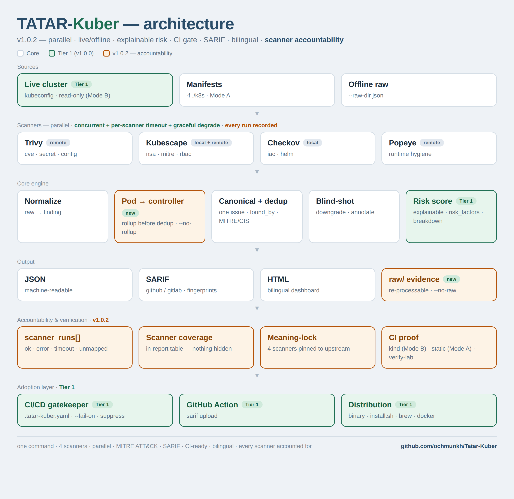
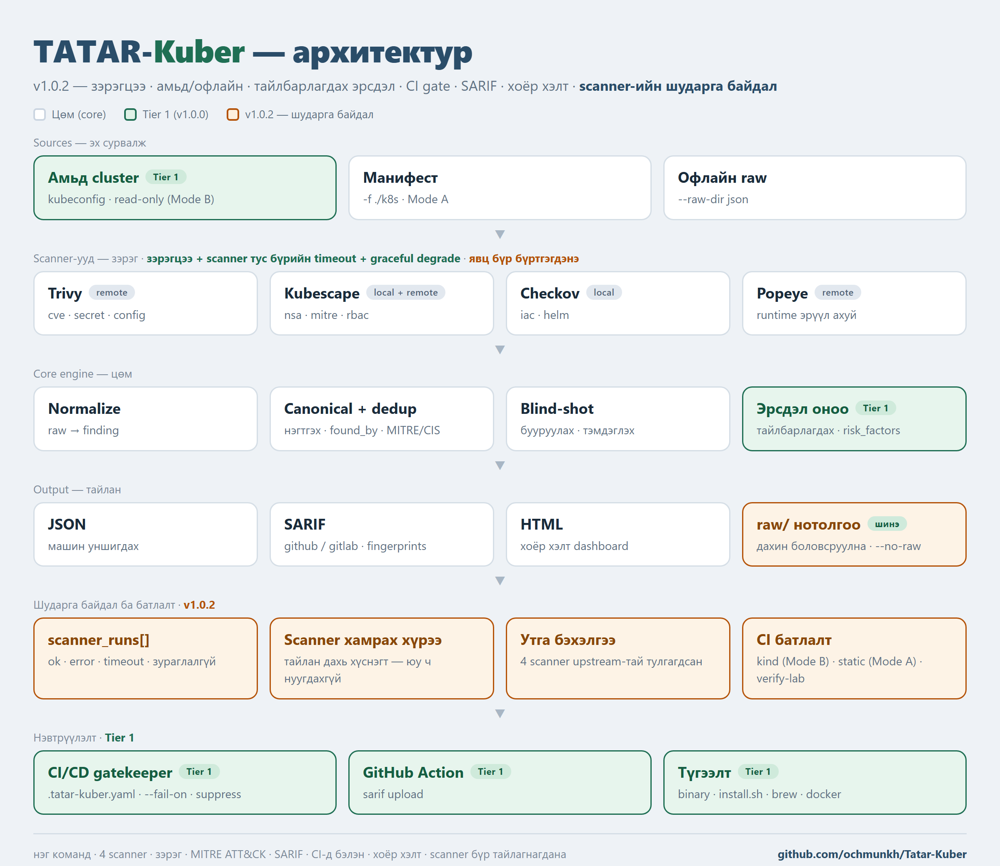

# TATAR-Kuber


[](https://github.com/ochmunkh/Tatar-Kuber/actions/workflows/ci.yml)
[](https://github.com/ochmunkh/Tatar-Kuber/actions/workflows/real-cluster.yml)


**Kubernetes security posture assessment framework — one command, four scanners, one standard report.**

TATAR-Kuber runs **Trivy · Kubescape · Checkov · Popeye**, unifies their output into one
**canonical control model**, de-duplicates it (so "3 scanners found 1 issue" instead of
"3 findings"), scores risk, and produces a single report — **JSON / SARIF / HTML**, in
**English or Mongolian** — that engineers, auditors and CISOs can all read.

**Author:** Enkhbat.O — Security Analyst

```bash
tatar-kuber scan   --kubeconfig ~/.kube/config -o out      # or: --raw-dir ./raw  (offline)
tatar-kuber report --input out/scan-result.json -o html --out report.html
# Mongolian report:  tatar-kuber scan ... --lang mn
```

## Report — one issue, every scanner, both languages

The same scan rendered in **English** and **Mongolian** (`--lang en|mn`). Note
`found_by = checkov · kubescape · trivy` on the privileged container: the unified,
de-duplicated view with confidence, evidence and remediation.

**🇬🇧 English report**


**🇲🇳 Монгол тайлан**


**See a real report without installing anything:** live example at
**https://ochmunkh.github.io/Tatar-Kuber/** ([English](https://ochmunkh.github.io/Tatar-Kuber/report.html) ·
[Монгол](https://ochmunkh.github.io/Tatar-Kuber/report-mn.html) ·
[SARIF](https://ochmunkh.github.io/Tatar-Kuber/tatar-kuber.sarif)), or open the committed
files in [`examples/report/`](examples/report).

## Deduplication in action (`3 findings → 1`)

Trivy, Kubescape and Checkov each flag the **same** privileged container on
`deployment/api` — with three different rule IDs:

```
Trivy      AVD-KSV0017  Privileged container      Deployment/api
Kubescape  C-0057       Privileged container      .../Deployment/production/api
Checkov    CKV_K8S_16   Container ... privileged   Deployment.production.api
```

TATAR-Kuber merges them into **one** finding:

```json
{ "canonical_control": "TATAR-CON-001", "resource": "deployment/api",
  "found_by": ["checkov", "kubescape", "trivy"], "confidence": "HIGH",
  "raw_refs": [{"scanner":"checkov","rule_id":"CKV_K8S_16"},
               {"scanner":"kubescape","rule_id":"C-0057"},
               {"scanner":"trivy","rule_id":"AVD-KSV0017"}] }
```

One issue, three tools agreeing (→ HIGH confidence), original rule IDs preserved.
Full walk-through: [`docs/dedup-example.md`](docs/dedup-example.md).

## Design principles

- **Read-Only First** — never modifies the customer environment (`get` / `list` / `watch` only).
- **Scanner Agnostic** — TATAR-Kuber is not a scanner; it is an Orchestrator + Normalizer +
  Risk Engine + Reporting Engine. Scanners are pluggable adapters.

## Scanner stack

| Scanner | Purpose | Live-tested with |
|---|---|---|
| Trivy | Image CVEs, secrets, misconfiguration | 0.74 (`k8s --report all`) |
| Kubescape | NSA / MITRE / RBAC / compliance (primary posture engine) | 4.0 (`--kube-contexts`) |
| Checkov | IaC (YAML / Helm / Terraform) | 3.2 (local mode) |
| Popeye | Runtime hygiene (dead service, unused, broken reference) | 0.22 |

> The "live-tested with" column is the version the [real-cluster workflow](.github/workflows/real-cluster.yml)
> actually runs against every week. Scanner CLIs rename flags between releases, so a mismatch shows up as
> `status: error` / `unavailable` in the report's *Scanner coverage* table rather than as a silent zero.

> `kube-bench` (node/CIS) needs a privileged DaemonSet and is out of MVP scope (Enterprise Agent).

## Features

- **Live Mode B** — scans a running cluster (read-only) by orchestrating the real scanner CLIs
- Local (Mode A) + **offline ingest** of pre-collected raw output
- **Parallel adapters** — scanners run concurrently, each with its own timeout; one failing scanner never drops the others (graceful degradation), output stays deterministic
- **Canonical Control Mapping** — every scanner's rule IDs unified into stable `TATAR-*` controls
- **Deduplication** — merges the same issue across scanners; keeps `found_by` + evidence
- **Confidence engine** — multi-scanner agreement and check determinism (a Trivy-only CVE is still HIGH)
- **Blind-shot engine** — context-aware severity down-grade (never suppresses; stays visible)
- **Explainable risk scoring v1.2.1** — per-finding `risk_factors` (base × context × exposure × confidence) + a cluster `risk_breakdown` with formula and top contributors
- **MITRE ATT&CK for Containers** — findings map to the adversary techniques they *may enable* (e.g. privileged container → T1611 Escape to Host), with a per-tactic **ATT&CK exposure** summary. Framed as exposure, **not** detection — see [`docs/MITRE_ATTACK.md`](docs/MITRE_ATTACK.md)
- **CI/CD gatekeeper** — `.tatar-kuber.yaml` policy (`fail_on`, `min_score`, `suppress` with expiry) + `gate` command + GitHub Action + SARIF upload to Code Scanning
- **Reports** — JSON · SARIF 2.1.0 (GitHub/GitLab/Azure) · HTML dashboard (bilingual)
- **verify-lab** — regression check against an expected-findings baseline
- **Self-contained binary** — canonical registry embedded; `brew` / `curl | sh` / Docker

## Scope & positioning

TATAR-Kuber focuses on **security posture, configuration, IaC, image and RBAC analysis
with unified reporting**. It is **complementary to — not a replacement for** — runtime
detection, admission control and secrets management. Run it *alongside* Falco/Tetragon,
Kyverno/OPA and Vault for full coverage.

**In scope**

| Domain | | Notes |
|---|:--:|---|
| Cluster configuration & posture | ✅ | via Kubescape / Trivy (live Mode B) |
| Kubernetes misconfiguration | ✅ | Trivy · Kubescape · Checkov |
| RBAC security | ✅ | excessive permissions, wildcard, cluster-admin |
| Pod / Workload security | ✅ | privileged, hostPath, capabilities, runAsRoot… |
| Image vulnerabilities | ✅ | CVEs via Trivy |
| IaC security | ✅ | YAML / Helm (Terraform partial, via Checkov) |
| Compliance mapping | ✅ | NSA / CIS / MITRE refs via canonical controls (partial) |
| Reporting & risk scoring | ✅ | dedup, risk score, JSON / SARIF / HTML |
| Runtime hygiene | ⚠️ | Popeye (dead / unused / broken refs) — not threat detection |

**Out of scope (by design) — use alongside**

| Not covered | Use instead |
|---|---|
| Runtime threat detection | Falco · Tetragon |
| Network traffic monitoring (eBPF) | Cilium/Hubble · Falco |
| Container behavioral detection | Falco · Tetragon |
| Admission control (block deploys) | Kyverno · OPA Gatekeeper |
| Secrets management | HashiCorp Vault · External Secrets |

## Install

```bash
# Homebrew (macOS / Linux)
brew install ochmunkh/tap/tatar-kuber

# curl | sh (Linux / macOS) — downloads the release binary + verifies checksum
curl -fsSL https://raw.githubusercontent.com/ochmunkh/Tatar-Kuber/main/install.sh | sh

# Docker
docker run --rm -v "$PWD:/work" -w /work ghcr.io/ochmunkh/tatar-kuber:latest \
    scan --raw-dir ./raw -o .

# From source
go install github.com/ochmunkh/tatar-kuber/cmd/tatar-kuber@latest
```

Check which scanners are installed for live scanning:

```bash
tatar-kuber doctor
```

## Quick start (offline, no cluster, no scanner install)

The companion [**tatar-kuber-lab**](https://github.com/ochmunkh/tatar-kuber-lab) repo ships
real scanner output so you can try the full pipeline in ~30 seconds:

```bash
git clone https://github.com/ochmunkh/tatar-kuber-lab
tatar-kuber scan --raw-dir tatar-kuber-lab/raw \
    --registry schema/canonical-controls.yaml -o out
tatar-kuber report    --input out/scan-result.json -o html --out report.html
tatar-kuber verify-lab --input out/scan-result.json \
    --expected tatar-kuber-lab/expected/expected-findings.json
```

## Architecture



```
sources → scanners (parallel) → normalize → canonical + dedup → blind-shot → risk score → report → CI gate
```

**Sources** — a live cluster (read-only, Mode B), local manifests (`-f`), or pre-collected raw output (`--raw-dir`).

**Scanners (parallel)** — Trivy, Kubescape, Checkov and Popeye run **concurrently**, each with its own timeout. If one scanner fails or times out, the others still finish (graceful degradation) and the output stays deterministic.

**Core engine** — normalize each tool's output into the unified schema, map to canonical `TATAR-*` controls and **de-duplicate** (one issue, `found_by` = every scanner that saw it), apply the blind-shot down-grade, then compute the **explainable** risk score (`risk_factors` per finding + a cluster `risk_breakdown`).

**Output** — JSON, SARIF 2.1.0 and a bilingual HTML dashboard, plus `verify-lab` regression.

**Adoption layer** — the `gate` command enforces a `.tatar-kuber.yaml` policy in CI (exit code), a GitHub Action uploads SARIF to Code Scanning, and the binary ships via brew / curl / Docker.

> **What changed in v1.0.0:** live-cluster scanning and parallel execution went from partial/experimental to fully working, the risk score became explainable, and the CI gate + distribution are new.

## Build

```bash
go build ./...
go test ./...          # 14 packages, all green
./scripts/build.sh 1.0.0
```

## CLI

```
tatar-kuber scan        --kubeconfig | --context | -f | --raw-dir  [--namespace ns1,ns2] [--lang en|mn] [--no-raw]
                        # live scan keeps raw scanner output in <out>/raw/ (evidence; re-ingestable via --raw-dir)
tatar-kuber report      -o json | sarif | html  [--fail-on HIGH]
tatar-kuber gate        --input scan-result.json [--policy .tatar-kuber.yaml] [--fail-on high] [--min-score N]
tatar-kuber doctor      # which scanners are installed, versions, supported modes
tatar-kuber verify-lab  --input scan-result.json --expected expected-findings.json
tatar-kuber version
```

## CI/CD gate

Add a `.tatar-kuber.yaml` (see [`.tatar-kuber.yaml.example`](.tatar-kuber.yaml.example)) and gate your pipeline, or use the GitHub Action:

```yaml
- uses: ochmunkh/Tatar-Kuber@v1
  with:
    raw-dir: ./raw      # or path: ./k8s
    fail-on: high
```

The action produces a SARIF file; upload it with `github/codeql-action/upload-sarif` to see findings in the **Security → Code scanning** tab (see [`.github/workflows/security-gate.yml`](.github/workflows/security-gate.yml)).

## Documentation

Six engineering documents in `docs/` (01 Unified Schema, 02 Canonical Mapping, 03 Scanner
Adapter Interface, 04 Severity & Risk Scoring, 05 CLI Spec, 06 Repository Structure).

## Status

**v1.0.1** — Live Mode B (parallel adapters) · explainable risk · CI/CD gatekeeper
(policy + GitHub Action + SARIF) · goreleaser + brew/curl/Docker · **scanner coverage report**.

**Honesty note (v1.0.1).** Auditing the v1.0.0 live run showed that all 11 findings came from
Kubescape alone: Trivy was silently contributing nothing (real Trivy emits `AVD-KSV-0017`, the
registry had `AVD-KSV0017`; `trivy k8s` defaults to `--report summary`; context is positional),
and adapter errors were swallowed. With per-scanner assertions in place, the same audit then caught two
more: Kubescape's `--kube-contexts` renames its own output file (fleet mode), and Popeye 0.22 changed
its JSON schema (`sanitizers` → `sections`) *and* the meaning of its POP codes — 7 of the 10 Popeye
mappings pointed at the wrong canonical control (e.g. POP-108 "unnamed port" was reported as
"Missing CPU/memory limits"). All are fixed and pinned by a test that checks every mapped POP code
against upstream's `codes.yaml`.

v1.0.1 fixes the adapters, records every scanner's outcome in
`metadata.scanner_runs` (status, duration, findings, unmapped rules) — shown in the HTML report
as *Scanner coverage* — keeps raw scanner output as evidence, and the
[real-cluster workflow](.github/workflows/real-cluster.yml) now asserts **each** scanner
produced findings and that at least one finding is corroborated by 2+ scanners.
A "0 findings" scanner is never silent again.

The same audit was then applied to **Checkov** (the Mode A scanner, never validated before — it does
not run against a live cluster): 2 of its 18 mappings were wrong. `CKV_K8S_43` is *"Image should use
digest"*, which fires on **any** tagged image — mapped to ":latest tag" it reported a properly pinned
`nginx:1.25.3` as using `:latest`. The real `:latest` check, `CKV_K8S_14`, was unmapped. And
`CKV_K8S_27` is *"Do not expose the docker daemon socket"*, not general hostPath (Checkov has no
general hostPath check at all). Both are fixed, every remaining mapping was verified against real
Checkov output, and coverage went from 18 to 28 rules. A new
[static-scan workflow](.github/workflows/static-scan.yml) runs real Checkov and `trivy config` on the
repo's own vulnerable manifests every week — **Mode A is now validated too, with no cluster needed.**

One more correction came out of reading the first good live report: Popeye's lint level
(info/warn/error) was overriding each control's **curated** `default_severity`, so a dead Service
was reported HIGH where the registry deliberately rates it INFO, and a missing probe MEDIUM instead
of LOW — inflating both the report and the risk score. A linter's log level is not a security
severity; adapters now set severity only when the scanner supplies a real one (Trivy AVD/CVE,
Checkov), and Popeye's level is kept in the evidence instead.
Where it's headed — v2 (audit-grade PDF + compliance mapping + trending), v3 (continuous +
dashboard): see the [**Roadmap**](ROADMAP.md).

## Security

A security tool should hold itself to the standard it enforces:

- **SAST + vuln scanning in CI** — every push runs [`govulncheck`](https://pkg.go.dev/golang.org/x/vuln/cmd/govulncheck)
  (known CVEs in dependencies **and** the Go standard library) and [`gosec`](https://github.com/securego/gosec)
  (static analysis), with gosec results uploaded to the GitHub **Code scanning** tab. See
  [`.github/workflows/ci.yml`](.github/workflows/ci.yml).
- **Patched toolchain** — release binaries are built with a current, patched Go stdlib
  (pinned via `toolchain` in `go.mod`), so the report renderer stays clear of `html/template` CVEs.
- **Minimal supply chain** — one direct dependency (`gopkg.in/yaml.v3`) plus the standard library.
- **Safe by construction** — read-only cluster access (`get`/`list`/`watch`), no shell invocation
  (scanners run via `exec` with fixed args, no `sh -c`), and reports render through `html/template`
  auto-escaping.
- **Handle output as sensitive** — a report can contain secret matches, CVEs and cluster detail;
  treat `scan-result.json` and HTML/SARIF reports as confidential.

Found a vulnerability? Use GitHub's **Security → Report a vulnerability** (private disclosure).

## Contributing

Contributions are welcome! 🎉 The cleanest first PR is a **new scanner adapter** — see
[CONTRIBUTING.md](CONTRIBUTING.md) and [`docs/03-Scanner-Adapter-Interface.md`](docs).
Please keep `go test ./...` green and read the [Code of Conduct](CODE_OF_CONDUCT.md).

## Contact

**Author:** Enkhbat Oyunbayar — Security Analyst · Ulaanbaatar

[](https://www.facebook.com/enkhbat.o/)
[](https://github.com/ochmunkh)

## License

Open Core. Community CLI — Apache-2.0.

---

## Монгол хэл дээр

**Kubernetes аюулгүй байдлын үнэлгээний framework — нэг команд, дөрвөн scanner, нэг стандарт тайлан.**

TATAR-Kuber нь **Trivy · Kubescape · Checkov · Popeye**-ийг ажиллуулж, тэдгээрийн гаралтыг
нэг **canonical control загвар** руу нэгтгэж, давхардлыг арилгаж ("3 scanner нэг асуудал
олсон" — 3 finding биш), эрсдэлийг үнэлж, нэг тайлан гаргана — **JSON / SARIF / HTML**,
**англи эсвэл монгол** хэлээр. Инженер / auditor / CISO бүгд ойлгоно.

**Зохиогч:** Enkhbat.O — Security Analyst

### Давхардлыг арилгах жишээ (`3 finding → 1`)

Trivy, Kubescape, Checkov гурав `deployment/api` дээрх **ижил** privileged контейнерыг
гурван өөр rule ID-гаар илрүүлнэ:

```
Trivy      AVD-KSV0017  Privileged container      Deployment/api
Kubescape  C-0057       Privileged container      .../Deployment/production/api
Checkov    CKV_K8S_16   Container ... privileged   Deployment.production.api
```

TATAR-Kuber эдгээрийг **нэг** finding болгож нэгтгэнэ:

```json
{ "canonical_control": "TATAR-CON-001", "resource": "deployment/api",
  "found_by": ["checkov", "kubescape", "trivy"], "confidence": "HIGH",
  "raw_refs": [{"scanner":"checkov","rule_id":"CKV_K8S_16"},
               {"scanner":"kubescape","rule_id":"C-0057"},
               {"scanner":"trivy","rule_id":"AVD-KSV0017"}] }
```

Нэг асуудал, гурван багаж санал нийлсэн (→ HIGH итгэл), эх rule ID-ууд хадгалагдсан.
Бүрэн тайлбар: [`docs/dedup-example.md`](docs/dedup-example.md).

**Суулгалгүйгээр жинхэнэ тайлан үзэх:** амьд жишээ
**https://ochmunkh.github.io/Tatar-Kuber/** ([Англи](https://ochmunkh.github.io/Tatar-Kuber/report.html) ·
[Монгол](https://ochmunkh.github.io/Tatar-Kuber/report-mn.html) ·
[SARIF](https://ochmunkh.github.io/Tatar-Kuber/tatar-kuber.sarif)), эсвэл
[`examples/report/`](examples/report)-д commit хийсэн файлуудыг нээ.

### Гол зарчим

- **Read-Only First** — customer орчинг хэзээ ч өөрчлөхгүй (зөвхөн `get` / `list` / `watch`).
- **Scanner Agnostic** — өөрөө scanner биш; Orchestrator + Normalizer + Risk Engine + Reporting.

### Scanner-ууд

| Scanner | Зорилго | Live-д тестлэгдсэн |
|---|---|---|
| Trivy | Image CVE, secret, misconfiguration | 0.74 (`k8s --report all`) |
| Kubescape | NSA / MITRE / RBAC / compliance (үндсэн posture engine) | 4.0 (`--kube-contexts`) |
| Checkov | IaC (YAML / Helm / Terraform) | 3.2 (local горим) |
| Popeye | Runtime hygiene (dead service, unused, broken reference) | 0.22 |

> "Live-д тестлэгдсэн" гэдэг нь [real-cluster workflow](.github/workflows/real-cluster.yml) 7 хоног тутам
> бодитоор ажиллуулдаг хувилбар. Scanner CLI-ууд хувилбар хооронд флагаа нэрлэж сольдог тул зөрүү нь
> тайлангийн *Scanner хамрах хүрээ* хүснэгтэд `status: error` / `unavailable` болж харагдана — чимээгүй
> тэг болохгүй.

> `kube-bench` (node/CIS) нь privileged DaemonSet шаарддаг тул MVP-д багтаагүй (Enterprise Agent).

### Онцлог

- **Live Mode B** — ажиллаж буй cluster-ийг (read-only) бодит scanner CLI-ууд ажиллуулан шалгана
- Local (Mode A) + **offline ingest** (урьдчилан цуглуулсан raw)
- **Parallel adapters** — scanner-ууд зэрэг ажиллана, тус бүр өөрийн timeout-той; нэг нь унахад бусад нь үргэлжилнэ (graceful degradation), гаралт detrministik хэвээр
- **Canonical Control Mapping** — scanner бүрийн rule ID-г нэг `TATAR-*` control руу
- **Deduplication** — олон scanner-ийн ижил асуудлыг нэгтгэж `found_by`-г хадгална
- **Confidence engine** — олон scanner-ийн санал нийлэлт + determinism (Trivy ганц CVE ч HIGH)
- **Blind-shot engine** — контекстээр severity бууруулна (устгахгүй, ил үлдэнэ)
- **Тайлбарлагдах risk scoring v1.2.1** — finding бүрийн `risk_factors` (суурь × орчин × ил гарц × итгэл) + cluster `risk_breakdown` (томьёо + топ хувь нэмэгчид)
- **MITRE ATT&CK for Containers** — finding нь ямар халдлагын техникийг *боломжжуулж* болзошгүйг харуулна (ж: privileged контейнер → T1611 Escape to Host), tactic тус бүрээр **ATT&CK exposure** хураангуйтай. "Илрүүлсэн" биш, "боломжжуулна" хүрээтэй — үз [`docs/MITRE_ATTACK.md`](docs/MITRE_ATTACK.md)
- **CI/CD gatekeeper** — `.tatar-kuber.yaml` бодлого (`fail_on`, `min_score`, хугацаатай `suppress`) + `gate` команд + GitHub Action + SARIF upload
- **Reports** — JSON · SARIF 2.1.0 · HTML dashboard (хоёр хэлт)
- **verify-lab** — expected baseline-тай тулгаж regression шалгах
- **Дангаар ажиллах binary** — canonical registry шигтгэсэн; `brew` / `curl | sh` / Docker

### Хамрах хүрээ (Scope)

TATAR-Kuber нь **posture / configuration / IaC / image / RBAC + нэгдсэн тайлан**-д
төвлөрдөг. Runtime threat detection (Falco/Tetragon), admission control (Kyverno/OPA),
secrets management (Vault)-ыг **орлохгүй — тэдгээртэй хамт ажилладаг (complementary).**

**Хийдэг**

| Домэйн | | Тайлбар |
|---|:--:|---|
| Cluster configuration & posture | ✅ | Kubescape / Trivy (live Mode B) |
| Kubernetes misconfiguration | ✅ | Trivy · Kubescape · Checkov |
| RBAC аюулгүй байдал | ✅ | хэт их эрх, wildcard, cluster-admin |
| Pod / Workload аюулгүй байдал | ✅ | privileged, hostPath, capabilities, runAsRoot… |
| Image эмзэг байдал | ✅ | Trivy CVE |
| IaC аюулгүй байдал | ✅ | YAML / Helm (Terraform хэсэгчлэн, Checkov) |
| Compliance mapping | ✅ | NSA / CIS / MITRE (canonical, хэсэгчлэн) |
| Тайлан & risk scoring | ✅ | dedup, оноо, JSON / SARIF / HTML |
| Runtime hygiene | ⚠️ | Popeye — threat detection БИШ |

**Хийхгүй (зориудаар) — хамт ашигла**

| Хамрахгүй | Оронд нь |
|---|---|
| Runtime threat detection | Falco · Tetragon |
| Network traffic monitoring (eBPF) | Cilium/Hubble · Falco |
| Container behavioral detection | Falco · Tetragon |
| Admission control (deploy блоклох) | Kyverno · OPA Gatekeeper |
| Secrets management | HashiCorp Vault · External Secrets |

### Түргэн эхлэл (offline, cluster/суулгац хэрэггүй)

```bash
git clone https://github.com/ochmunkh/tatar-kuber-lab
tatar-kuber scan --raw-dir tatar-kuber-lab/raw \
    --registry schema/canonical-controls.yaml --lang mn -o out
tatar-kuber report --input out/scan-result.json -o html --out report.html
```

### Архитектур



```
эх сурвалж → scanner-ууд (зэрэг) → normalize → canonical + dedup → blind-shot → risk score → тайлан → CI gate
```

**Эх сурвалж** — ажиллаж буй cluster (read-only, Mode B), локал манифест (`-f`), эсвэл урьдчилан цуглуулсан raw (`--raw-dir`).

**Scanner-ууд (зэрэг)** — Trivy, Kubescape, Checkov, Popeye нь **зэрэг** ажиллана, тус бүр өөрийн timeout-той. Нэг scanner унах/timeout болоход бусад нь үргэлжилнэ (graceful degradation), гаралт detrministik хэвээр.

**Цөм** — scanner бүрийн гаралтыг нэгдсэн схем рүү хөрвүүлж, canonical `TATAR-*` control руу зурж **давхардлыг арилгана** (нэг асуудал, `found_by` = олсон бүх scanner), blind-shot бууралт хийж, дараа нь **тайлбарлагдах** risk оноог тооцно (finding бүрт `risk_factors` + cluster `risk_breakdown`).

**Гаралт** — JSON, SARIF 2.1.0, хоёр хэлт HTML dashboard, мөн `verify-lab` regression.

**Adoption layer** — `gate` команд нь `.tatar-kuber.yaml` бодлогыг CI-д мөрдүүлнэ (exit code), GitHub Action нь SARIF-ийг Code Scanning руу upload хийнэ, binary нь brew / curl / Docker-оор түгнэ.

> **v1.0.0-д юу өөрчлөгдсөн:** live-cluster scan болон зэрэгцээ ажиллагаа хэсэгчлэн/туршилтын түвшнээс бүрэн ажиллагаатай болов; risk оноо тайлбарлагдах болов; CI gate + түгээлт шинээр нэмэгдэв.

### CLI командууд

```
tatar-kuber scan        --kubeconfig | --context | -f | --raw-dir  [--namespace ns1,ns2] [--lang en|mn] [--no-raw]
                        # live scan нь scanner-уудын түүхий гаралтыг <out>/raw/-д хадгална (нотолгоо; --raw-dir-ээр дахин боловсруулна)
tatar-kuber report      -o json | sarif | html  [--fail-on HIGH]
tatar-kuber gate        --input scan-result.json [--policy .tatar-kuber.yaml] [--fail-on high] [--min-score N]
tatar-kuber doctor      # ямар scanner суусан, хувилбар, дэмжих горим
tatar-kuber verify-lab  --input scan-result.json --expected expected-findings.json
tatar-kuber version
```

### Суулгах

```bash
brew install ochmunkh/tap/tatar-kuber
curl -fsSL https://raw.githubusercontent.com/ochmunkh/Tatar-Kuber/main/install.sh | sh
docker run --rm -v "$PWD:/work" -w /work ghcr.io/ochmunkh/tatar-kuber:latest scan --raw-dir ./raw -o .
```

### Build

```bash
go build ./...
go test ./...          # 14 багц, бүгд ногоон
./scripts/build.sh 1.0.0
```

### Баримт бичиг

`docs/` дотор 6 инженерийн баримт (01 Unified Schema, 02 Canonical Mapping, 03 Scanner
Adapter Interface, 04 Severity & Risk Scoring, 05 CLI Spec, 06 Repository Structure).

### Туршилтын лаборатори

Эмзэг/аюулгүй manifest + regression baseline тусдаа repo-д:
[**tatar-kuber-lab**](https://github.com/ochmunkh/tatar-kuber-lab).

### Төлөв

**v1.0.1** — Live Mode B (parallel adapters) · тайлбарлагдах эрсдэл · CI/CD gatekeeper
(бодлого + GitHub Action + SARIF) · goreleaser + brew/curl/Docker · **scanner хамрах хүрээний тайлан**.

**Шударга тэмдэглэл (v1.0.1).** v1.0.0-ийн live run-ыг аудит хийхэд 11 finding бүгд зөвхөн
Kubescape-ээс ирсэн нь тогтоогдсон: Trivy чимээгүй юу ч өгөөгүй (бодит Trivy `AVD-KSV-0017`
гэж гаргадаг, registry-д `AVD-KSV0017` байсан; `trivy k8s` default нь `--report summary`;
context нь positional), adapter-ийн алдаанууд залгигдаж байсан. v1.0.1-д adapter-уудыг зассан,
scanner бүрийн үр дүнг `metadata.scanner_runs`-д (төлөв, хугацаа, finding, зураглалгүй rule)
бичдэг болгосон. Scanner тус бүрийн шалгалт нэмэгдсэний дараа мөнөөх аудит дахин хоёрыг барив:
Kubescape-ийн `--kube-contexts` (fleet mode) нь гаралтын файлын нэрийг өөрөө сольдог, мөн Popeye 0.22
нь JSON схемээ (`sanitizers` → `sections`) БОЛОН POP кодынхоо утгыг сольсон — Popeye-ийн 10
зураглалын 7 нь буруу canonical control руу зааж байсан (ж: POP-108 "unnamed port"-ыг "Missing
CPU/memory limits" гэж тайлагнаж байв). Бүгдийг зассан ба зураглагдсан POP код бүрийг upstream-ийн
`codes.yaml`-тай тулгах тестээр бэхэлсэн.

HTML тайланд *Scanner хамрах хүрээ* хэсгээр харуулна, түүхий scanner гаралтыг
нотолгоо болгон хадгална, [real-cluster workflow](.github/workflows/real-cluster.yml) одоо
scanner **тус бүр** finding өгснийг ба ядаж нэг finding 2+ scanner-ээр батлагдсаныг шалгана.
"0 finding" scanner дахиж хэзээ ч чимээгүй өнгөрөхгүй.

Дараа нь яг ижил аудитыг **Checkov** дээр хийв (Mode A-ийн scanner, өмнө нь огт батлагдаагүй —
live cluster дээр ажилладаггүй): 18 зураглалын 2 нь буруу байв. `CKV_K8S_43` нь *"Image should use
digest"*, ямар ч tag-тай image дээр гардаг — ":latest tag" руу зурагдсанаас зөв пиннэсэн
`nginx:1.25.3`-ыг ":latest ашиглаж байна" гэж тайлагнаж байв. ":latest"-ийн жинхэнэ шалгалт
`CKV_K8S_14` нь зураглалгүй байсан. Мөн `CKV_K8S_27` нь *"Do not expose the docker daemon socket"*,
ерөнхий hostPath БИШ (Checkov-д ерөнхий hostPath шалгалт огт байхгүй). Хоёуланг зассан, бусад
зураглал бүрийг бодит Checkov гаралтаар батлав, хамрах хүрээ 18 -> 28 rule болов. Шинэ
[static-scan workflow](.github/workflows/static-scan.yml) нь бодит Checkov ба `trivy config`-ыг
өөрийн эмзэг манифест дээр 7 хоног тутам ажиллуулна — **Mode A ч одоо батлагдаж байна, cluster
шаардахгүйгээр.**

Анхны бүтэн live тайланг уншихад нэг засвар бас гарлаа: Popeye-ийн lint level
(info/warn/error) нь control бүрийн **curated** `default_severity`-г дарж байсан тул dead Service
нь registry-д зориудаар INFO гэж үнэлэгдсэн байхад HIGH, missing probe нь LOW байхад MEDIUM
болж тайлан болон эрсдэлийн онооны хоёуланг хөөрөгдөж байв. Линтерийн log-level нь аюулгүй
байдлын severity биш: adapter-ууд одоо зөвхөн scanner бодит severity өгсөн үед (Trivy AVD/CVE,
Checkov) л түүнийг ашиглана, Popeye-ийн level нь нотолгоо дотор үлдэнэ.
Хаашаа явж байгаа — v2 (аудитын PDF + compliance mapping + trending), v3 (тасралтгүй +
dashboard): [**Замын зураг**](ROADMAP.md)-г үз.

### Аюулгүй байдал

Аюулгүй байдлын багаж өөрөө өөрийн шаарддаг стандартыг барих ёстой:

- **CI-д SAST + CVE скан** — push бүрд [`govulncheck`](https://pkg.go.dev/golang.org/x/vuln/cmd/govulncheck)
  (хамаарал **болон** Go stdlib дахь мэдэгдэж буй CVE) + [`gosec`](https://github.com/securego/gosec)
  (статик шинжилгээ) ажиллана; gosec-ийн үр дүн GitHub **Code scanning** таб руу ордог.
  ([`.github/workflows/ci.yml`](.github/workflows/ci.yml)).
- **Patched toolchain** — release бинарууд зассан Go stdlib-ээр build хийгддэг (`go.mod`-ийн
  `toolchain`-аар бэхлэсэн) тул тайлан рендерлэгч `html/template` CVE-үүдээс цэвэр.
- **Минимал supply chain** — ганц шууд хамаарал (`gopkg.in/yaml.v3`) + stdlib.
- **Бүтцээрээ аюулгүй** — read-only cluster хандалт (`get`/`list`/`watch`), shell дуудлагагүй
  (scanner-ууд тогтмол аргументтэй `exec`-ээр, `sh -c` байхгүй), тайлан `html/template`
  auto-escape-аар рендерлэгддэг.
- **Гаралтыг нууц гэж үз** — тайлан нь secret, CVE, cluster мэдээлэл агуулж болзошгүй тул
  `scan-result.json` болон HTML/SARIF тайланг нууц мэдээлэл гэж хандах.

Эмзэг байдал олсон уу? GitHub-ын **Security → Report a vulnerability** (хаалттай мэдээлэл).

### Холбоо барих

**Зохиогч:** Enkhbat Oyunbayar — Security Analyst · Улаанбаатар

[](https://www.facebook.com/enkhbat.o/)
[](https://github.com/ochmunkh)
