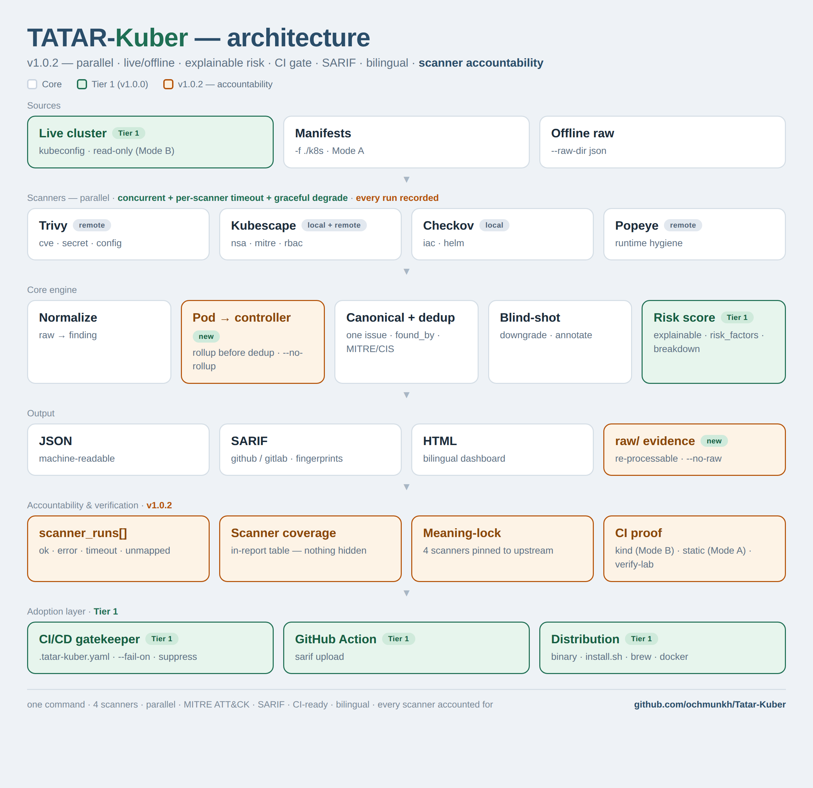
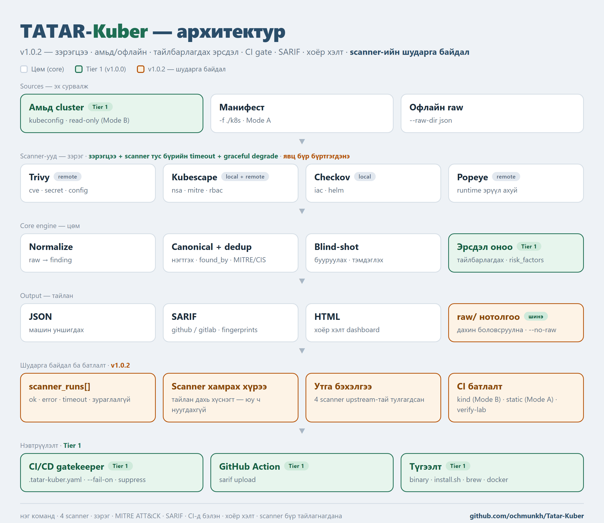

# TATAR-Kuber


[](https://github.com/ochmunkh/Tatar-Kuber/actions/workflows/ci.yml)
[](https://github.com/ochmunkh/Tatar-Kuber/actions/workflows/real-cluster.yml)


**Kubernetes security posture assessment framework — one command, four scanners, one standard report.**

TATAR-Kuber runs **Trivy · Kubescape · Checkov · Popeye**, unifies their output into one
**canonical control model**, de-duplicates it (so "3 scanners found 1 issue" instead of
"3 findings"), scores risk, and produces a single report — **JSON / SARIF / HTML**, in
**English or Mongolian** — that engineers, auditors and CISOs can all read.

```bash
tatar-kuber scan   --kubeconfig ~/.kube/config --out-dir out   # or: --raw-dir ./raw  (offline)
tatar-kuber report --input out/scan-result.json --format html --out report.html
tatar-kuber report --input out/scan-result.json --format html --lang mn --out mn.html
```

One scan, either language: `report` takes `--lang` too, so switching the report's
language never re-runs the scanners or touches the cluster again.

The CLI itself is **English by default** — usage, every flag description, errors, the
per-scanner progress lines and the gate verdict. `--lang mn` (or `TATAR_LANG=mn`)
switches all of it to Mongolian.

## Report — one issue, every scanner, both languages

The same scan rendered in **English** and **Mongolian** (`--lang en|mn`). Note
`found_by = checkov · kubescape · trivy` on the privileged container: the unified,
de-duplicated view with confidence, evidence and remediation.

**🇬🇧 English report**


**🇲🇳 Монгол тайлан**


**See a real report without installing anything:** live example at
**https://ochmunkh.github.io/Tatar-Kuber/** ([English](https://ochmunkh.github.io/Tatar-Kuber/report.html) ·
[Монгол](https://ochmunkh.github.io/Tatar-Kuber/report-mn.html) ·
[SARIF](https://ochmunkh.github.io/Tatar-Kuber/tatar-kuber.sarif)), or open the committed
files in [`examples/report/`](examples/report).

## Deduplication in action (`3 findings → 1`)

Trivy, Kubescape and Checkov each flag the **same** privileged container on
`deployment/api` — with three different rule IDs:

```
Trivy      AVD-KSV0017  Privileged container      Deployment/api
Kubescape  C-0057       Privileged container      .../Deployment/production/api
Checkov    CKV_K8S_16   Container ... privileged   Deployment.production.api
```

TATAR-Kuber merges them into **one** finding:

```json
{ "canonical_control": "TATAR-CON-001", "resource": "deployment/api",
  "found_by": ["checkov", "kubescape", "trivy"], "confidence": "HIGH",
  "raw_refs": [{"scanner":"checkov","rule_id":"CKV_K8S_16"},
               {"scanner":"kubescape","rule_id":"C-0057"},
               {"scanner":"trivy","rule_id":"AVD-KSV0017"}] }
```

One issue, three tools agreeing (→ HIGH confidence), original rule IDs preserved.
Full walk-through: [`docs/dedup-example.md`](docs/dedup-example.md).

## Design principles

- **Read-Only First** — never modifies the customer environment (`get` / `list` / `watch` only).
- **Scanner Agnostic** — TATAR-Kuber is not a scanner; it is an Orchestrator + Normalizer +
  Risk Engine + Reporting Engine. Scanners are pluggable adapters.

## Scanner stack

| Scanner | Purpose | Live-tested with |
|---|---|---|
| Trivy | Image CVEs, secrets, misconfiguration | 0.74 (`k8s --report all`) |
| Kubescape | NSA / MITRE / RBAC / compliance (primary posture engine) | 4.0 (`--kube-contexts`) |
| Checkov | IaC (YAML / Helm / Terraform) | 3.2 (local mode) |
| Popeye | Runtime hygiene (dead service, unused, broken reference) | 0.22 |

> The "live-tested with" column is the version the [real-cluster workflow](.github/workflows/real-cluster.yml)
> actually runs against every day. Scanner CLIs rename flags between releases, so a mismatch shows up as
> `status: error` / `unavailable` in the report's *Scanner coverage* table rather than as a silent zero.

> `kube-bench` (node/CIS) needs a privileged DaemonSet and is out of MVP scope (Enterprise Agent).

## Features

- **Live Mode B** — scans a running cluster (read-only) by orchestrating the real scanner CLIs
- Local (Mode A) + **offline ingest** of pre-collected raw output
- **Parallel adapters** — scanners run concurrently, each with its own timeout; one failing scanner never drops the others (graceful degradation), output stays deterministic
- **Canonical Control Mapping** — every scanner's rule IDs unified into stable `TATAR-*` controls
- **Deduplication** — merges the same issue across scanners; keeps `found_by` + evidence
- **Confidence engine** — multi-scanner agreement and check determinism (a Trivy-only CVE is still HIGH)
- **Blind-shot engine** — context-aware severity down-grade (never suppresses; stays visible)
- **Explainable risk scoring v1.2.1** — per-finding `risk_factors` (base × context × exposure × confidence) + a cluster `risk_breakdown` with formula and top contributors
- **MITRE ATT&CK for Containers** — findings map to the adversary techniques they *may enable* (e.g. privileged container → T1611 Escape to Host), with a per-tactic **ATT&CK exposure** summary. Framed as exposure, **not** detection — see [`docs/MITRE_ATTACK.md`](docs/MITRE_ATTACK.md)
- **CI/CD gatekeeper** — `.tatar-kuber.yaml` policy (`fail_on`, `min_score`, `suppress` with expiry) + `gate` command + GitHub Action + SARIF upload to Code Scanning
- **Reports** — JSON · SARIF 2.1.0 (GitHub/GitLab/Azure) · HTML dashboard (bilingual)
- **verify-lab** — regression check against an expected-findings baseline
- **Self-contained binary** — canonical registry embedded; `brew` / `curl | sh` / Docker

## Scope & positioning

TATAR-Kuber focuses on **security posture, configuration, IaC, image and RBAC analysis
with unified reporting**. It is **complementary to — not a replacement for** — runtime
detection, admission control and secrets management. Run it *alongside* Falco/Tetragon,
Kyverno/OPA and Vault for full coverage.

**In scope**

| Domain | | Notes |
|---|:--:|---|
| Cluster configuration & posture | ✅ | via Kubescape / Trivy (live Mode B) |
| Kubernetes misconfiguration | ✅ | Trivy · Kubescape · Checkov |
| RBAC security | ✅ | excessive permissions, wildcard, cluster-admin |
| Pod / Workload security | ✅ | privileged, hostPath, capabilities, runAsRoot… |
| Image vulnerabilities | ✅ | CVEs via Trivy |
| IaC security | ✅ | YAML / Helm (Terraform partial, via Checkov) |
| Compliance mapping | ✅ | NSA / CIS / MITRE refs via canonical controls (partial) |
| Reporting & risk scoring | ✅ | dedup, risk score, JSON / SARIF / HTML |
| Runtime hygiene | ⚠️ | Popeye (dead / unused / broken refs) — not threat detection |

**Out of scope (by design) — use alongside**

| Not covered | Use instead |
|---|---|
| Runtime threat detection | Falco · Tetragon |
| Network traffic monitoring (eBPF) | Cilium/Hubble · Falco |
| Container behavioral detection | Falco · Tetragon |
| Admission control (block deploys) | Kyverno · OPA Gatekeeper |
| Secrets management | HashiCorp Vault · External Secrets |

## Install

```bash
# Homebrew (macOS / Linux)
brew install ochmunkh/tap/tatar-kuber

# curl | sh (Linux / macOS) — downloads the release binary + verifies checksum
curl -fsSL https://raw.githubusercontent.com/ochmunkh/Tatar-Kuber/master/install.sh | sh

# Docker
docker run --rm -v "$PWD:/work" -w /work ghcr.io/ochmunkh/tatar-kuber:latest \
    scan --raw-dir ./raw --out-dir .

# From source
go install github.com/ochmunkh/tatar-kuber/cmd/tatar-kuber@latest
```

Check which scanners are installed for live scanning:

```bash
tatar-kuber doctor
```

## Quick start (offline, no cluster, no scanner install)

This repo ships real scanner output in [`examples/demo`](examples/demo), so the full pipeline
runs in ~30 seconds — no `--registry` flag needed, the canonical registry is embedded in
the binary:

```bash
git clone https://github.com/ochmunkh/Tatar-Kuber && cd Tatar-Kuber
tatar-kuber scan   --raw-dir examples/demo --out-dir out
tatar-kuber report --input out/scan-result.json --format html --out report.html
```

For the full regression corpus — vulnerable & hardened manifests plus the
`expected-findings.json` baseline — add the companion
[**tatar-kuber-lab**](https://github.com/ochmunkh/tatar-kuber-lab) repo:

```bash
git clone https://github.com/ochmunkh/tatar-kuber-lab
tatar-kuber scan       --raw-dir tatar-kuber-lab/raw --out-dir lab-out
tatar-kuber verify-lab --input lab-out/scan-result.json \
    --expected tatar-kuber-lab/expected/expected-findings.json
```

## Architecture



```
sources → scanners (parallel) → normalize → canonical + dedup → blind-shot → risk score → report → CI gate
```

**Sources** — a live cluster (read-only, Mode B), local manifests (`-f`), or pre-collected raw output (`--raw-dir`).

**Scanners (parallel)** — Trivy, Kubescape, Checkov and Popeye run **concurrently**, each with its own timeout. If one scanner fails or times out, the others still finish (graceful degradation) and the output stays deterministic.

**Core engine** — normalize each tool's output into the unified schema, map to canonical `TATAR-*` controls and **de-duplicate** (one issue, `found_by` = every scanner that saw it), apply the blind-shot down-grade, then compute the **explainable** risk score (`risk_factors` per finding + a cluster `risk_breakdown`).

**Output** — JSON, SARIF 2.1.0 and a bilingual HTML dashboard, plus `verify-lab` regression.

**Adoption layer** — the `gate` command enforces a `.tatar-kuber.yaml` policy in CI (exit code), a GitHub Action uploads SARIF to Code Scanning, and the binary ships via brew / curl / Docker.

> **What changed in v1.0.0:** live-cluster scanning and parallel execution went from partial/experimental to fully working, the risk score became explainable, and the CI gate + distribution are new.

## Build

```bash
go build ./...
go test ./...          # 19 packages, all green
./scripts/build.sh 1.0.3
```

## CLI

```
tatar-kuber scan        --kubeconfig | --context | -f | --raw-dir  [--out-dir DIR] [--namespace ns1,ns2] [--no-raw] [--no-rollup]
                        # live scan keeps raw scanner output in <out>/raw/ (evidence; re-ingestable via --raw-dir)
tatar-kuber report      --input scan-result.json --format json | sarif | html  [--out FILE] [--fail-on high]
tatar-kuber gate        --input scan-result.json [--policy .tatar-kuber.yaml] [--fail-on high] [--min-score N]
                        # --baseline prev/scan-result.json : fail only on NEW and WORSENED
tatar-kuber doctor      # which scanners are installed, versions, supported modes
tatar-kuber diff        --old prev/scan-result.json --new out/scan-result.json
                        # trending: new / fixed / worsened / improved  [--fail-on-new high] [--format json]
tatar-kuber verify-lab  --input scan-result.json --expected expected-findings.json
tatar-kuber update      [--scanner trivy,popeye] [--dry-run] [--check] [--home ~/.tatar-kuber]
tatar-kuber version

every command also accepts   [--lang en|mn]
```

`scan --out-dir` is a **directory**; `report --format` / `diff --format` is a **format**. Both
still accept the older `-o` spelling, so existing pipelines keep working — but `-o` meant two
different things depending on the command, so the long names are what the docs use. Severity
thresholds (`--fail-on`, `--fail-on-new`, `fail_on:`) are case-insensitive.

**Updating the scanners.** `tatar-kuber update` downloads each scanner, checks its SHA256
against the pin in `~/.tatar-kuber/tools.lock.yaml`, and only then installs it. A mismatch
installs nothing at all — not even the scanners that did verify — and a scanner with no
pinned checksum is refused *before* the download is made, so there is no trust-on-first-use
path. `--dry-run` prints exactly what would be fetched (scanner, version, URL, expected
checksum) and writes nothing; `--check` compares the pins with what the lock records as
installed. The cosign step of the specification is **not implemented yet**: signatures are
not verified, the command says so on every run, and `tools.lock.yaml` records
`cosign: unverified` rather than claiming otherwise.

**Output language.** Everything the tool prints is **English by default**. `--lang mn`
switches all of it — usage, flag descriptions, errors, progress and gate verdicts — to
Mongolian, and `TATAR_LANG=mn` sets it for a whole session (the flag wins over the
environment). Every command takes `--lang`, and an unknown value is a usage error
(exit `3`) on every one of them. On `report`, `--lang` re-renders the report itself as
well; without it the report keeps the language chosen at scan time, so existing
pipelines are unaffected.

One known exception: a few **finding descriptions produced by the scanner adapters**
are still Mongolian-only and are written that way into `scan-result.json`, so they
appear untranslated even in an `en` document — Trivy's secret findings ("Илэрсэн
нууц: …") are the case you will actually hit. These are serialised schema fields
rather than console output, so making them bilingual changes the v1 document shape
and is tracked separately.

### Live Mode B — granting read-only access

Live cluster scanning needs credentials, and "trust me, it's read-only" is not an answer a
platform team should accept. The RBAC is therefore a reviewable file in this repo:

```bash
kubectl apply -f deploy/least-privilege-clusterrole.yaml
tatar-kuber scan --kubeconfig ~/.kube/config --namespace prod --out-dir ./out
```

[`deploy/least-privilege-clusterrole.yaml`](deploy/least-privilege-clusterrole.yaml) is
self-contained — it creates the ClusterRole `tatar-kuber-reader`, the ServiceAccount
`tatar-kuber` in `kube-system`, and the ClusterRoleBinding between them. Nothing else is
needed. Every rule in it grants only `get` / `list` / `watch`: there is no `create`,
`update`, `patch` or `delete` verb anywhere in the file, which is the whole of the
**Read-Only First** promise in a form you can diff.

Secrets are the one place worth stating plainly: the ClusterRole does grant read access to
`secrets` because RBAC and mount analysis need to know which secrets exist and what mounts
them — but TATAR-Kuber reads **metadata only** and never the secret *values*.

### Exit codes

The `gate` command exists to be wired into a pipeline, so its exit code is a contract. Under
`set -e`, "policy violated" and "the tool could not read its input" must not look the same:

| Code | Meaning | Where it comes from |
|---|---|---|
| `0` | success / gate passed | every command |
| `1` | policy or threshold violation | `gate` FAILED, `diff --fail-on-new`, `report --fail-on`, `verify-lab` FAIL, `doctor` with **no scanner installed** |
| `2` | runtime error — input unreadable or malformed, **or an unrecognised flag** | a missing or corrupt `scan-result.json` or expected-findings file, or a **corrupt** policy file — a *missing* policy file is not an error (`.tatar-kuber.yaml` is optional: the built-in `fail_on: high` default applies, so the gate still runs and can return `1`); also `--no-such-flag`, which Go's flag parser rejects before the command runs |
| `3` | usage error — unknown command, format or language, or a missing required flag | `tatar-kuber frobnicate`, `report --format nope`, `report --lang de`, `diff` without `--old`, `scan` without an input |

An **unrecognised** severity threshold is deliberately *not* a usage error, so it never
appears as `3`. `report --fail-on` and `diff --fail-on-new` warn on stderr and skip the check
(exit `0`); `gate --fail-on` and `fail_on:` warn and fall back to the built-in `high`, which
is the strict direction. A typo therefore never silently *tightens* a gate — but on `report`
and `diff` it silently *disables* one, so treat that warning as actionable in CI.

`tatar-kuber doctor` returns **1** on a machine with no scanners installed. That is a
deliberate readiness signal, not an error — but it means `doctor` under `set -e` will stop a
fresh runner, so guard it (`tatar-kuber doctor || true`) if you only want the table.

## CI/CD gate

Add a `.tatar-kuber.yaml` (see [`.tatar-kuber.yaml.example`](.tatar-kuber.yaml.example)) and gate your pipeline, or use the GitHub Action:

```yaml
- uses: ochmunkh/Tatar-Kuber@v1
  with:
    raw-dir: ./raw      # or path: ./k8s
    fail-on: high
```

The action produces a SARIF file; upload it with `github/codeql-action/upload-sarif` to see findings in the **Security → Code scanning** tab (see [`.github/workflows/security-gate.yml`](.github/workflows/security-gate.yml)).

### Adopting the gate on an existing cluster

The first scan of a real cluster returns a lot. A gate that fails on all of it on day one
gets switched off in a week, and a switched-off gate is not a gate. Two mechanisms exist so
that does not happen — use them in this order.

**1. Baseline — accept today, fail on tomorrow.** Keep the current scan as a reference and
let the gate count only what is new or has got worse:

```bash
tatar-kuber gate --input out/scan-result.json --baseline baseline/scan-result.json
```

Findings already in the baseline are not counted. Findings that were there but whose
severity has risen **are** counted — a LOW that becomes CRITICAL is new risk, not an old
problem. `min_score` stays absolute: it is a property of the cluster, not of the diff.

If the comparison cannot be trusted — a different cluster, a different mode, one side
scanned with `--no-rollup` — the baseline is **ignored** and every finding counts. A
security gate fails closed when it is unsure.

*Where to keep it.* Commit `baseline/scan-result.json` to the repo. It is a few hundred KB
of JSON, it belongs under review like any other accepted risk, and `git log` then answers
"when did we accept this, and who signed it off". A CI cache or artifact works too, but it
expires, and a baseline that silently disappears turns the gate red on a Monday for no
reason anyone can explain. Refresh it deliberately — a commit that moves the baseline is a
commit that says "we accept this list now".

**2. Suppression — accept one finding, with a reason and an expiry date.** For the handful
you decide to live with, name them in `.tatar-kuber.yaml`:

```yaml
suppress:
  - control: TATAR-CON-001
    resource: deployment/legacy-api
    reason: "Legacy system, migrating Q1 2027 (JIRA-1234)"
    expires: 2027-03-31
```

`expires` is not decoration: the rule stops applying on that date and the finding comes
back. The gate also reports rules that have expired, rules pointing at a control that does
not exist, and rules that matched nothing — a suppression nobody notices is how an accepted
risk becomes a forgotten one.

Baseline is for the bulk at adoption; suppression is for the few you consciously keep.

## Documentation

Six engineering documents in `docs/`, as **Word (`.docx`) files** — GitHub will not render
them in the browser, so download them:
[01 Unified Schema](docs/01_Unified-Schema-JSON-v1.docx) ·
[02 Canonical Mapping](docs/02_Canonical-Control-Mapping.docx) ·
[03 Scanner Adapter Interface](docs/03_Scanner-Adapter-Interface.docx) ·
[04 Severity & Risk Scoring](docs/04_Severity-Risk-Scoring-Model.docx) ·
[05 CLI Spec](docs/05_CLI-Specification.docx) ·
[06 Repository Structure](docs/06_Repository-Structure.docx).

**[`docs/coverage.md`](docs/coverage.md)** — what the tool actually checks: every canonical
control against every scanner, generated from the registry and kept in step with it by a
test. Controls that no rule maps to are listed as **not checked** rather than quietly
counted. Today that is 1 of 33.

**[`pkg/schema/tatar-schema-v1.json`](pkg/schema/tatar-schema-v1.json)** — the JSON Schema
for `scan-result.json`, the interchange format `report` / `gate` / `diff` / `verify-lab` all
consume and adopters commit as a baseline. Pinned against the Go structs by a test, so it
cannot drift silently.

**[`docs/releases/`](docs/releases)** — the source of truth for every release's notes;
GitHub's release page is a copy, and CI diffs the two daily.

## Status

**v1.0.3** — Live Mode B (parallel adapters) · explainable risk · CI/CD gatekeeper
(policy + GitHub Action + SARIF) · goreleaser + brew/curl/Docker · scanner coverage report ·
Pod → controller rollup · **scan trending (`diff`)** · **`report --lang` — one scan, either
language** · **honest `scan_mode`**.

Per-release detail — the four-scanner mapping audit, the rollup design, the trending
rationale — is in [**docs/releases/**](docs/releases) rather than repeated here.

Scoreboard for the mapping audit: **Popeye 7 of 10 wrong, Kubescape 6 of 28, Checkov 2 of 18,
Trivy 0 of 11.** Every mapped rule in all four scanners is now pinned by a test against upstream's
own definitions, so a scanner renaming or renumbering a check fails the build.

Where it's headed — v2 (audit-grade PDF + compliance mapping + trending), v3 (continuous +
dashboard): see the [**Roadmap**](ROADMAP.md).

## Security

A security tool should hold itself to the standard it enforces:

- **SAST + vuln scanning in CI** — every push runs [`govulncheck`](https://pkg.go.dev/golang.org/x/vuln/cmd/govulncheck)
  (known CVEs in dependencies **and** the Go standard library) and [`gosec`](https://github.com/securego/gosec)
  (static analysis), with gosec results uploaded to the GitHub **Code scanning** tab. See
  [`.github/workflows/ci.yml`](.github/workflows/ci.yml).
- **Patched toolchain** — release binaries are built with a current, patched Go stdlib
  (pinned via `toolchain` in `go.mod`), so the report renderer stays clear of `html/template` CVEs.
- **Minimal supply chain** — one direct dependency (`gopkg.in/yaml.v3`) plus the standard library.
- **Safe by construction** — read-only cluster access (`get`/`list`/`watch`, granted by the
  reviewable [`deploy/least-privilege-clusterrole.yaml`](deploy/least-privilege-clusterrole.yaml)
  — Secret *metadata* only, never secret values), no shell invocation
  (scanners run via `exec` with fixed args, no `sh -c`), and reports render through `html/template`
  auto-escaping.
- **Handle output as sensitive** — a report can contain secret matches, CVEs and cluster detail;
  treat `scan-result.json` and HTML/SARIF reports as confidential.

Found a vulnerability? Use GitHub's **Security → Report a vulnerability** (private disclosure).

## Contributing

Contributions are welcome! 🎉 The cleanest first PR is a **new scanner adapter** — see
[CONTRIBUTING.md](CONTRIBUTING.md) and
[`docs/03_Scanner-Adapter-Interface.docx`](docs/03_Scanner-Adapter-Interface.docx).
Please keep `go test ./...` green and read the [Code of Conduct](CODE_OF_CONDUCT.md).

## Contact

**Author:** Enkhbat Oyunbayar — Security Analyst

[](https://www.facebook.com/enkhbat.o/)
[](https://github.com/ochmunkh)

## License

Open Core. Community CLI — Apache-2.0.

---

## Монгол хэл дээр

**Kubernetes аюулгүй байдлын үнэлгээний framework — нэг команд, дөрвөн scanner, нэг стандарт тайлан.**

TATAR-Kuber нь **Trivy · Kubescape · Checkov · Popeye**-ийг ажиллуулж, тэдгээрийн гаралтыг
нэгдсэн **canonical control загварт** нэгтгэж, давхардлыг арилгаж ("3 scanner нэг асуудал
олсон" — 3 finding биш), эрсдэлийг үнэлж, нэг тайлан гаргана — **JSON / SARIF / HTML**,
**англи эсвэл монгол** хэлээр. Инженер, аудитор, CISO аль аль нь ойлгоход хялбар.

### Давхардлыг арилгах жишээ (`3 finding → 1`)

Trivy, Kubescape, Checkov гурав `deployment/api` дээрх **ижил** privileged контейнерыг
гурван өөр rule ID-гаар илрүүлнэ:

```
Trivy      AVD-KSV0017  Privileged container      Deployment/api
Kubescape  C-0057       Privileged container      .../Deployment/production/api
Checkov    CKV_K8S_16   Container ... privileged   Deployment.production.api
```

TATAR-Kuber эдгээрийг **нэг** finding болгож нэгтгэнэ:

```json
{ "canonical_control": "TATAR-CON-001", "resource": "deployment/api",
  "found_by": ["checkov", "kubescape", "trivy"], "confidence": "HIGH",
  "raw_refs": [{"scanner":"checkov","rule_id":"CKV_K8S_16"},
               {"scanner":"kubescape","rule_id":"C-0057"},
               {"scanner":"trivy","rule_id":"AVD-KSV0017"}] }
```

Нэг асуудал, гурван багаж санал нийлсэн (→ HIGH итгэл), эх rule ID-ууд хадгалагдсан.
Бүрэн тайлбар: [`docs/dedup-example.md`](docs/dedup-example.md).

**Суулгалгүйгээр жинхэнэ тайлан үзэх:** амьд жишээ
**https://ochmunkh.github.io/Tatar-Kuber/** ([Англи](https://ochmunkh.github.io/Tatar-Kuber/report.html) ·
[Монгол](https://ochmunkh.github.io/Tatar-Kuber/report-mn.html) ·
[SARIF](https://ochmunkh.github.io/Tatar-Kuber/tatar-kuber.sarif)), эсвэл
[`examples/report/`](examples/report)-д commit хийсэн файлуудыг нээ.

### Гол зарчим

- **Read-Only First** — customer орчинг хэзээ ч өөрчлөхгүй (зөвхөн `get` / `list` / `watch`).
- **Scanner Agnostic** — өөрөө scanner биш; Orchestrator + Normalizer + Risk Engine + Reporting.

### Scanner-ууд

| Scanner | Зорилго | Бодит орчинд шалгасан |
|---|---|---|
| Trivy | Image CVE, secret, misconfiguration | 0.74 (`k8s --report all`) |
| Kubescape | NSA / MITRE / RBAC / compliance (үндсэн posture engine) | 4.0 (`--kube-contexts`) |
| Checkov | IaC (YAML / Helm / Terraform) | 3.2 (local горим) |
| Popeye | Runtime hygiene (dead service, unused, broken reference) | 0.22 |

> "Бодит орчинд шалгасан" гэдэг нь [real-cluster workflow](.github/workflows/real-cluster.yml) өдөр бүр
> бодитоор ажиллуулдаг хувилбар. Scanner CLI-ууд хувилбар хооронд флагаа нэрлэж сольдог тул зөрүү нь
> тайлангийн *Scanner хамрах хүрээ* хүснэгтэд `status: error` / `unavailable` болж харагдана — чимээгүй
> тэг болохгүй.

> `kube-bench` (node/CIS) нь privileged DaemonSet шаарддаг тул MVP-д багтаагүй (Enterprise Agent).

### Онцлог

- **Live Mode B** — ажиллаж буй cluster-ийг (read-only) бодит scanner CLI-ууд ажиллуулан шалгана
- Local (Mode A) + **offline ingest** (урьдчилан цуглуулсан raw)
- **Parallel adapters** — scanner-ууд зэрэг ажиллана, тус бүр өөрийн timeout-той; нэг нь унахад бусад нь үргэлжилнэ (graceful degradation), гаралт нь тогтмол, давтагдахуйц хэвээр
- **Canonical Control Mapping** — scanner бүрийн rule ID-г нэг `TATAR-*` control руу
- **Deduplication** — олон scanner-ийн ижил асуудлыг нэгтгэж `found_by`-г хадгална
- **Confidence engine** — олон scanner-ийн санал нийлэлт + determinism (Trivy ганц CVE ч HIGH)
- **Blind-shot engine** — контекстээр severity бууруулна (устгахгүй, ил үлдэнэ)
- **Тайлбарлагдах risk scoring v1.2.1** — finding бүрийн `risk_factors` (суурь × орчин × ил гарц × итгэл) + cluster `risk_breakdown` (томьёо + топ хувь нэмэгчид)
- **MITRE ATT&CK for Containers** — finding нь ямар халдлагын техникийг *боломжжуулж* болзошгүйг харуулна (ж: privileged контейнер → T1611 Escape to Host), tactic тус бүрээр **ATT&CK exposure** хураангуйтай. "Илрүүлсэн" биш, "боломжжуулна" хүрээтэй — үз [`docs/MITRE_ATTACK.md`](docs/MITRE_ATTACK.md)
- **CI/CD gatekeeper** — `.tatar-kuber.yaml` бодлого (`fail_on`, `min_score`, хугацаатай `suppress`) + `gate` команд + GitHub Action + SARIF upload
- **Reports** — JSON · SARIF 2.1.0 · HTML dashboard (хоёр хэлт)
- **verify-lab** — expected baseline-тай тулгаж regression шалгах
- **Дангаар ажиллах binary** — canonical registry шигтгэсэн; `brew` / `curl | sh` / Docker

### Хамрах хүрээ (Scope)

TATAR-Kuber нь **posture / configuration / IaC / image / RBAC + нэгдсэн тайлан**-д
төвлөрдөг. Runtime threat detection (Falco/Tetragon), admission control (Kyverno/OPA),
secrets management (Vault)-ыг **орлохгүй — тэдгээртэй хамт ажилладаг (complementary).**

**Хийдэг**

| Домэйн | | Тайлбар |
|---|:--:|---|
| Cluster configuration & posture | ✅ | Kubescape / Trivy (live Mode B) |
| Kubernetes misconfiguration | ✅ | Trivy · Kubescape · Checkov |
| RBAC аюулгүй байдал | ✅ | хэт их эрх, wildcard, cluster-admin |
| Pod / Workload аюулгүй байдал | ✅ | privileged, hostPath, capabilities, runAsRoot… |
| Image эмзэг байдал | ✅ | Trivy CVE |
| IaC аюулгүй байдал | ✅ | YAML / Helm (Terraform хэсэгчлэн, Checkov) |
| Compliance mapping | ✅ | NSA / CIS / MITRE (canonical, хэсэгчлэн) |
| Тайлан & risk scoring | ✅ | dedup, оноо, JSON / SARIF / HTML |
| Runtime hygiene | ⚠️ | Popeye — threat detection БИШ |

**Хамрахгүй (зориудаар) — хамт ашиглана**

| Хамрахгүй | Оронд нь |
|---|---|
| Runtime threat detection | Falco · Tetragon |
| Network traffic monitoring (eBPF) | Cilium/Hubble · Falco |
| Container behavioral detection | Falco · Tetragon |
| Admission control (deploy блоклох) | Kyverno · OPA Gatekeeper |
| Secrets management | HashiCorp Vault · External Secrets |

### Түргэн эхлэл (offline — cluster ба scanner суулгах шаардлагагүй)

Энэ repo-д бодит scanner гаралт [`examples/demo`](examples/demo)-д шигтгэсэн байдаг тул бүтэн
pipeline ~30 секундэд ажиллана. `--registry` флаг ШААРДАХГҮЙ — canonical registry нь
binary дотор шигтгэгдсэн:

```bash
git clone https://github.com/ochmunkh/Tatar-Kuber && cd Tatar-Kuber
tatar-kuber scan   --raw-dir examples/demo --out-dir out
tatar-kuber report --input out/scan-result.json --format html --lang mn --out report.html
```

Бүрэн regression corpus (эмзэг ба hardened manifest, `expected-findings.json` baseline)-ыг
дагалдах [**tatar-kuber-lab**](https://github.com/ochmunkh/tatar-kuber-lab) repo-оос нэмнэ:

```bash
git clone https://github.com/ochmunkh/tatar-kuber-lab
tatar-kuber scan       --raw-dir tatar-kuber-lab/raw --out-dir lab-out
tatar-kuber verify-lab --input lab-out/scan-result.json \
    --expected tatar-kuber-lab/expected/expected-findings.json
```

Нэг scan, аль ч хэл: `report` ч `--lang` авдаг тул тайлангийн хэлийг сэлгэхэд
scanner-ууд дахин ажиллахгүй, cluster руу дахин хандахгүй.

CLI өөрөө default-оор **англи** хэлээр ярина — usage, флаг бүрийн тайлбар, алдаа,
scanner тус бүрийн явцын мөр, gate-ийн шийдвэр. `--lang mn` (эсвэл `TATAR_LANG=mn`)
нь бүгдийг монгол руу сэлгэнэ.

### Архитектур



```
эх сурвалж → scanner-ууд (зэрэг) → normalize → canonical + dedup → blind-shot → risk score → тайлан → CI gate
```

**Эх сурвалж** — ажиллаж буй cluster (read-only, Mode B), локал манифест (`-f`), эсвэл урьдчилан цуглуулсан raw (`--raw-dir`).

**Scanner-ууд (зэрэг)** — Trivy, Kubescape, Checkov, Popeye нь **зэрэг** ажиллана, тус бүр өөрийн timeout-той. Нэг scanner унах/timeout болоход бусад нь үргэлжилнэ (graceful degradation), гаралт нь тогтмол, давтагдахуйц хэвээр.

**Цөм** — scanner бүрийн гаралтыг нэгдсэн схем рүү хөрвүүлж, canonical `TATAR-*` control-той холбож **давхардлыг арилгана** (нэг асуудал, `found_by` = олсон бүх scanner), blind-shot бууралт хийж, дараа нь **тайлбарлагдах** risk оноог тооцно (finding бүрт `risk_factors` + cluster `risk_breakdown`).

**Гаралт** — JSON, SARIF 2.1.0, англи, монгол хэл дээрх HTML dashboard, мөн `verify-lab` regression.

**Нэвтрүүлэлтийн түвшин** — `gate` команд нь `.tatar-kuber.yaml` бодлогыг CI-д мөрдүүлнэ (exit code), GitHub Action нь SARIF-ийг Code Scanning руу upload хийнэ, binary нь brew / curl / Docker-оор түгнэ.

> **v1.0.0-д юу өөрчлөгдсөн:** live-cluster scan болон зэрэгцээ гүйцэтгэл хэсэгчлэн/туршилтын түвшнээс бүрэн ажиллагаатай болов; risk оноо тайлбарлагдах болов; CI gate + түгээлт шинээр нэмэгдэв.

### CLI командууд

```
tatar-kuber scan        --kubeconfig | --context | -f | --raw-dir  [--out-dir DIR] [--namespace ns1,ns2] [--no-raw] [--no-rollup]
                        # live scan нь scanner-уудын түүхий гаралтыг <out>/raw/-д хадгална (нотолгоо; --raw-dir-ээр дахин боловсруулна)
tatar-kuber report      --input scan-result.json --format json | sarif | html  [--out FILE] [--fail-on high]
tatar-kuber gate        --input scan-result.json [--policy .tatar-kuber.yaml] [--fail-on high] [--min-score N]
                        # --baseline prev/scan-result.json : зөвхөн шинэ ба дордсон finding дээр fail болно
tatar-kuber doctor      # ямар scanner суусан, хувилбар, дэмжих горим
tatar-kuber diff        --old prev/scan-result.json --new out/scan-result.json
                        # тренд: шинэ / зассан / дордсон / сайжирсан  [--fail-on-new high] [--format json]
tatar-kuber verify-lab  --input scan-result.json --expected expected-findings.json
tatar-kuber update      [--scanner trivy,popeye] [--dry-run] [--check] [--home ~/.tatar-kuber]
tatar-kuber version

команд бүр мөн хүлээж авна   [--lang en|mn]
```

`scan --out-dir` нь **хавтас**, `report --format` / `diff --format` нь **формат**. Хоёул `-o`
гэсэн хуучин бичиглэлээ хэвээр хүлээж авна (байгаа pipeline эвдрэхгүй) — гэхдээ `-o` нь
командаас хамаарч хоёр өөр зүйл гэсэн утгатай байсан тул баримтад бүтэн нэрийг ашиглана.
Severity босго (`--fail-on`, `--fail-on-new`, `fail_on:`) нь үсгийн том/жижигт үл хамаарна.

**Scanner-уудыг шинэчлэх.** `tatar-kuber update` нь scanner бүрийг татаж, SHA256-ыг нь
`~/.tatar-kuber/tools.lock.yaml` доторх pin-тэй тулгаж, дараа нь л суулгана. Нэг нь зөрвөл
ЮУ Ч суухгүй — баталгаажсан scanner-ууд нь ч суухгүй. Пиннэсэн checksum-гүй scanner нь
татагдахаас нь ӨМНӨ татгалзагдана, тиймээс trust-on-first-use гэсэн зам огт байхгүй.
`--dry-run` нь юу татагдахыг яг таг (scanner, хувилбар, URL, хүлээгдэх checksum) хэвлээд
юу ч бичихгүй; `--check` нь pin-үүдийг lock-д суусан гэж бичигдсэнтэй тулгана.
Тодорхойлолтын cosign алхам **хараахан хэрэгжээгүй**: гарын үсэг шалгагддаггүй, команд
үүнийгээ ажиллалт бүрт хэлнэ, `tools.lock.yaml` нь өөрөөр мэдүүлэхийн оронд
`cosign: unverified` гэж бичигдэнэ.

**Гаралтын хэл.** Хэрэгслийн хэвлэдэг бүх зүйл default-оор **англи**. `--lang mn` нь
бүгдийг — usage, флагийн тайлбар, алдаа, явцын мөр, gate-ийн шийдвэрийг — монгол руу
сэлгэнэ, `TATAR_LANG=mn` нь бүтэн session-д тавина (флаг нь орчны хувьсагчийг дарна).
`--lang`-ыг команд бүр хүлээж авах бөгөөд танигдаагүй утга нь команд бүрт хэрэглээний
алдаа (exit `3`). `report` дээр `--lang` нь тайланг өөрийг нь ч дахин үүсгэнэ; өгөөгүй
бол тайлан scan-д сонгосон хэлээрээ үлдэх тул байгаа pipeline хөндөгдөхгүй.

Мэдэгдэж байгаа нэг үл хамаарах зүйл: **scanner adapter-ийн үүсгэдэг зарим finding-ийн
тайлбар** нь монгол хэл дээр хатуу бичигдсэн бөгөөд `scan-result.json`-д тэр чигээрээ
ордог тул `en` баримт дотор ч орчуулагдаагүй харагдана — практикт тааралдах нь Trivy-ийн
нууц илрүүлэлт ("Илэрсэн нууц: …"). Эдгээр нь консолын гаралт биш, схемийн цуваа
талбарууд тул хоёр хэлтэй болгох нь v1 баримтын хэлбэрийг өөрчилнө — тусад нь
шийдвэрлэнэ.

### Live Mode B — read-only хандалт олгох

Амьд кластерыг шалгахад эрх шаардагдана, "read-only гэдэгт минь итгэ" гэдэг нь platform
багийн хүлээж авах хариулт биш. Тиймээс RBAC нь энэ repo дотор хянагдах боломжтой файл юм:

```bash
kubectl apply -f deploy/least-privilege-clusterrole.yaml
tatar-kuber scan --kubeconfig ~/.kube/config --namespace prod --out-dir ./out
```

[`deploy/least-privilege-clusterrole.yaml`](deploy/least-privilege-clusterrole.yaml) нь
дангаараа бүрэн: `tatar-kuber-reader` ClusterRole, `kube-system`-д `tatar-kuber`
ServiceAccount, мөн тэдгээрийг холбох ClusterRoleBinding-ыг үүсгэнэ. Өөр юу ч нэмэх
шаардлагагүй. Дүрэм бүр нь ЗӨВХӨН `get` / `list` / `watch` эрх олгодог: файлын хаана ч
`create`, `update`, `patch`, `delete` verb байхгүй — **Read-Only First** гэсэн зарчим
бүхэлдээ diff хийж шалгах боломжтой хэлбэрт байна.

Secret-ийн талаар ил хэлэх нь зүйтэй: RBAC ба mount шинжилгээнд ямар secret байгаа, түүнийг
хэн mount хийж байгааг мэдэх шаардлагатай тул ClusterRole нь `secrets` уншихыг зөвшөөрдөг —
харин TATAR-Kuber нь ЗӨВХӨН metadata уншина, secret-ийн УТГЫГ хэзээ ч уншихгүй.

### Exit code

`gate` команд нь pipeline-д холбогдохын тулд байдаг тул түүний exit code бол гэрээ. `set -e`
дор "бодлого зөрчигдсөн" ба "хэрэгсэл оролтоо уншиж чадсангүй" хоёр ижил харагдаж болохгүй:

| Код | Утга | Хаанаас гардаг |
|---|---|---|
| `0` | амжилттай / gate давсан | бүх команд |
| `1` | бодлого эсвэл босго зөрчигдсөн | `gate` FAILED, `diff --fail-on-new`, `report --fail-on`, `verify-lab` FAIL, `doctor` — **ямар ч scanner суугаагүй** |
| `2` | ажиллагааны алдаа — оролт уншигдсангүй/эвдэрсэн, эсвэл **танигдаагүй флаг** | байхгүй/эвдэрсэн `scan-result.json` эсвэл expected-findings файл, мөн **эвдэрсэн** бодлогын файл — бодлогын файл БАЙХГҮЙ бол алдаа БИШ (`.tatar-kuber.yaml` нь сонголт: built-in `fail_on: high` default хэрэглэгдэж gate ажиллаад `1` буцааж ч болно); мөн `--no-such-flag` — үүнийг Go-ийн flag parser команд ажиллахаас өмнө буцаана |
| `3` | хэрэглээний алдаа — команд, формат, хэл танигдсангүй, эсвэл заавал флаг дутуу | `tatar-kuber frobnicate`, `report --format nope`, `report --lang de`, `--old`-гүй `diff`, оролтгүй `scan` |

Severity босго **танигдаагүй** тохиолдол нь зориуд хэрэглээний алдаа БИШ, тиймээс `3`
болж харагдахгүй. `report --fail-on` ба `diff --fail-on-new` нь stderr-т анхааруулаад
шалгалтыг алгасна (exit `0`); `gate --fail-on` ба `fail_on:` нь анхааруулаад built-in `high`
руу унана — энэ нь ХАТУУ тал. Тиймээс бичиглэлийн алдаа gate-ийг хэзээ ч чимээгүй
ХАТУУРУУЛАХГҮЙ — харин `report` ба `diff` дээр шалгалтыг чимээгүй УНТРААНА, тул CI-д тэр
анхааруулгыг үйлдэл шаардсан гэж авч үзнэ.

`tatar-kuber doctor` нь scanner суугаагүй машин дээр **1** буцаана. Энэ бол алдаа биш,
зориудын бэлэн байдлын дохио — гэхдээ `set -e` дор шинэ runner-ыг зогсооно, тиймээс зөвхөн
хүснэгт хэрэгтэй бол `tatar-kuber doctor || true` гэж хамгаална.

### Байгаа кластерт gate нэвтрүүлэх

Бодит кластерын анхны шалгалт олон зүйл буцаана. Эхний өдөр бүгдэд нь унадаг gate нэг
долоо хоногийн дараа унтраагдана — унтраасан gate бол gate биш. Ингэхээс сэргийлэх хоёр
механизм бий, энэ дарааллаар ашиглана.

**1. Baseline — өнөөдрийн төлөвийг хүлээн зөвшөөрч, маргаашийн өөрчлөлтийг шалгах.** Одоогийн шалгалтыг лавлагаа
болгож үлдээгээд, зөвхөн шинэ ба дордсоныг тооцуулна:

```bash
tatar-kuber gate --input out/scan-result.json --baseline baseline/scan-result.json
```

Baseline-д аль хэдийн байгаа олдвор тооцогдохгүй. Харин байсан атлаа severity нь өссөн бол
**тооцогдоно** — LOW нь CRITICAL болох нь шинэ эрсдэл, хуучин асуудал биш. `min_score` нь
үнэмлэхүй хэвээр: тэр бол кластерын шинж чанар, зөрүүнийх биш.

Харьцуулалт итгэх боломжгүй бол — өөр cluster, өөр горим, нэг тал нь `--no-rollup` —
baseline **хэрэгсэгдэхгүй**, бүх олдвор тооцогдоно. Аюулгүй байдлын gate эргэлзээтэй үедээ
fail-closed зарчмаар ажиллана.

*Хаана хадгалах вэ.* `baseline/scan-result.json`-ыг repo-д commit хийнэ. Хэдэн зуун KB JSON,
бусад хүлээн зөвшөөрсөн эрсдэлийн адил хянагдах ёстой, мөн `git log` нь "хэзээ, хэн үүнийг
зөвшөөрсөн" гэсэн асуултад хариулна. CI cache/artifact ч болно, гэхдээ хугацаа нь дуусдаг —
чимээгүй алга болсон baseline нь даваа гарагт gate-ийг хэн ч тайлбарлаж чадахгүйгээр улаан
болгоно. Шинэчлэхдээ зориудаар: baseline-ыг хөдөлгөсөн commit бол "бид энэ жагсаалтыг одоо
хүлээн зөвшөөрч байна" гэсэн мэдэгдэл.

**2. Suppress — нэг олдворыг шалтгаан ба хугацаатайгаар хүлээн зөвшөөрөх.** Ухамсартай
үлдээхээр шийдсэн цөөн эрсдэлийг `.tatar-kuber.yaml`-д нэрлэнэ:

```yaml
suppress:
  - control: TATAR-CON-001
    resource: deployment/legacy-api
    reason: "Хуучин систем, 2027 Q1-д шилжүүлнэ (JIRA-1234)"
    expires: 2027-03-31
```

`expires` нь чимэглэл биш: тэр өдөр дүрэм идэвхгүй болж, олдвор буцаж гарна. Мөн gate нь
хугацаа дууссан дүрэм, байхгүй control руу заасан дүрэм, юунд ч тохироогүй дүрмийг
мэдэгдэнэ — хэн ч анзаардаггүй suppress бол мартагдсан эрсдэл болох зам.

Baseline нь нэвтрүүлэх үеийн олон тоонд, suppress нь ухамсартай үлдээсэн цөөнд.

### Суулгах

```bash
brew install ochmunkh/tap/tatar-kuber
curl -fsSL https://raw.githubusercontent.com/ochmunkh/Tatar-Kuber/master/install.sh | sh
docker run --rm -v "$PWD:/work" -w /work ghcr.io/ochmunkh/tatar-kuber:latest scan --raw-dir ./raw --out-dir .
```

### Build

```bash
go build ./...
go test ./...          # 19 багц, бүгд ногоон
./scripts/build.sh 1.0.3
```

### Баримт бичиг

`docs/` дотор 6 инженерийн баримт, **Word (`.docx`) файл** хэлбэрээр — GitHub тэднийг
browser дээр харуулахгүй тул татаж үзнэ:
[01 Unified Schema](docs/01_Unified-Schema-JSON-v1.docx) ·
[02 Canonical Mapping](docs/02_Canonical-Control-Mapping.docx) ·
[03 Scanner Adapter Interface](docs/03_Scanner-Adapter-Interface.docx) ·
[04 Severity & Risk Scoring](docs/04_Severity-Risk-Scoring-Model.docx) ·
[05 CLI Spec](docs/05_CLI-Specification.docx) ·
[06 Repository Structure](docs/06_Repository-Structure.docx).

**[`docs/coverage.md`](docs/coverage.md)** — хэрэгсэл яг юуг шалгадгийг харуулна:
canonical control бүрийг scanner бүртэй тулгасан матриц. Registry-ээс үүсдэг бөгөөд тестээр
нийцлийг нь барина. Ямар ч rule зураглагдаагүй control-ыг "шалгагддаггүй" гэж ил гаргана —
33-аас 1 нь.

**[`pkg/schema/tatar-schema-v1.json`](pkg/schema/tatar-schema-v1.json)** —
`scan-result.json`-ы JSON Schema. `report` / `gate` / `diff` / `verify-lab` бүгд үүнийг
уншдаг, adopter нь baseline болгож commit хийдэг солилцооны формат. Go бүтэцтэй нийцлийг
тестээр барьсан тул чимээгүй зөрөх боломжгүй.

**[`docs/releases/`](docs/releases)** — хувилбар бүрийн тэмдэглэлийн эх хувь; GitHub-ын
release хуудас нь ХУУЛБАР бөгөөд CI хоёрын зөрүүг өдөр бүр шалгадаг.

### Туршилтын лаборатори

Эмзэг/аюулгүй manifest + regression baseline тусдаа repo-д:
[**tatar-kuber-lab**](https://github.com/ochmunkh/tatar-kuber-lab).

### Төлөв

**v1.0.3** — Live Mode B (parallel adapters) · тайлбарлагдах эрсдэл · CI/CD gatekeeper
(бодлого + GitHub Action + SARIF) · goreleaser + brew/curl/Docker · scanner хамрах хүрээний тайлан ·
Pod → controller rollup · **тренд (`diff`)** · **`report --lang` — нэг scan, аль ч хэл** ·
**үнэн `scan_mode`**.

Хувилбар тус бүрийн дэлгэрэнгүй — дөрвөн scanner-ийн зураглалын аудит, rollup-ийн зохиомж,
трендийн шалтгаан — энд давтагдахын оронд [**docs/releases/**](docs/releases)-д байна.

Зураглалын аудитын дүн: **Popeye 10-аас 7 буруу, Kubescape 28-аас 6, Checkov 18-аас 2,
Trivy 11-ээс 0.** Дөрвүүлэнгийн зурагдсан rule бүр одоо upstream-ийн өөрийн тодорхойлолттой тулгах
тестээр бэхлэгдсэн тул scanner шалгалтаа дахин нэрлэхэд build унана.

Хаашаа явж байгаа — v2 (аудитын PDF + compliance mapping + trending), v3 (тасралтгүй +
dashboard): [**Замын зураг**](ROADMAP.md)-г үз.

### Аюулгүй байдал

Аюулгүй байдлын багаж өөрөө өөрийн шаарддаг стандартыг барих ёстой:

- **CI-д SAST + CVE скан** — push бүрд [`govulncheck`](https://pkg.go.dev/golang.org/x/vuln/cmd/govulncheck)
  (хамаарал **болон** Go stdlib дахь мэдэгдэж буй CVE) + [`gosec`](https://github.com/securego/gosec)
  (статик шинжилгээ) ажиллана; gosec-ийн үр дүн GitHub **Code scanning** таб руу ордог.
  ([`.github/workflows/ci.yml`](.github/workflows/ci.yml)).
- **Patched toolchain** — release бинарууд зассан Go stdlib-ээр build хийгддэг (`go.mod`-ийн
  `toolchain`-аар бэхлэсэн) тул тайлан рендерлэгч `html/template` CVE-үүдээс цэвэр.
- **Минимал supply chain** — ганц шууд хамаарал (`gopkg.in/yaml.v3`) + stdlib.
- **Бүтцээрээ аюулгүй** — read-only cluster хандалт (`get`/`list`/`watch`; хянагдах
  [`deploy/least-privilege-clusterrole.yaml`](deploy/least-privilege-clusterrole.yaml)-аар
  олгогдоно — Secret-ийн ЗӨВХӨН metadata, утгыг хэзээ ч уншихгүй), shell дуудлагагүй
  (scanner-ууд тогтмол аргументтэй `exec`-ээр, `sh -c` байхгүй), тайлан `html/template`
  auto-escape-аар рендерлэгддэг.
- **Гаралтыг нууц гэж үз** — тайлан нь secret, CVE, cluster мэдээлэл агуулж болзошгүй тул
  `scan-result.json` болон HTML/SARIF тайланг нууц мэдээлэл гэж хандах.

Эмзэг байдал олсон уу? GitHub-ын **Security → Report a vulnerability** (хаалттай мэдээлэл).

### Холбоо барих

**Зохиогч:** Enkhbat Oyunbayar — Security Analyst

[](https://www.facebook.com/enkhbat.o/)
[](https://github.com/ochmunkh)
