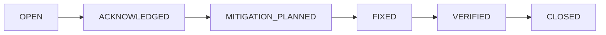

# TATAR-Kuber

> Kubernetes Security Posture Assessment Framework  
> Engineering Document #1  
> Unified Finding Schema  
> v1 — Нэгдсэн илрүүлэлтийн өгөгдлийн загвар  
> Version 1.3  ·  кодтой тулгасан (2026-09-27)  
> Enkhbat.O — Security Analyst  
> 2026-07-24

<!-- Generated from 01_Unified-Schema-JSON-v1.docx by scripts/docx-to-md.py -- do not edit by hand. -->
*Generated from `01_Unified-Schema-JSON-v1.docx`. The Word document is canonical; regenerate with `python3 scripts/docx-to-md.py docs/01_Unified-Schema-JSON-v1.docx`.*

## 1. Зорилго

Энэхүү баримт нь TATAR-Kuber-ийн бүх scanner (Trivy, Kubescape, Checkov, Popeye)-ийн гаралтыг нэг стандарт өгөгдлийн загвар (Unified Finding Schema) руу хөрвүүлэх ганц эх сурвалж юм. Бүх normalization, deduplication, risk scoring, reporting модуль энэ загварыг барьж ажиллана. Схем буруу бол код бүхэлдээ буруу суурьтай болно — тиймээс энэ баримтыг эхний баримт болгон түгжсэн.

**Гол зарчим:** scanner бүр өөр өөр гаралттай ч, TATAR-ийн дотоод ертөнцөд зөвхөн нэг л finding объект оршдог. Scanner-ийн онцлог мэдээлэл `found_by` болон `raw_refs` талбарт хадгалагдана.

## 2. scan-result.json — дээд түвшний бүтэц

Нэг scan бүр дараах бүтэцтэй ганц JSON файл (~/.tatar-kuber/scan-result.json) үүсгэнэ. Энэ нь metadata, summary, findings\[\] гэсэн гурван хэсэгтэй.

```json
{
  "schema_version": "1.0",
  "metadata": {
    "scan_id": "b3f1c9d2-...",           // UUID
    "cluster_name": "production",         // context эсвэл -f зам
    "scan_mode": "remote",                // local | remote | offline
    "tatar_version": "1.0.2",
    "scanner_versions": {                 // audit-д зайлшгүй
      "trivy": "0.53.0",
      "kubescape": "3.0.8",
      "checkov": "3.2.0",
      "popeye": "0.21.5"
    },
    "started_at": "2026-07-24T09:12:03Z",
    "finished_at": "2026-07-24T09:14:41Z",
    "result_hash": "sha256:9af2..."       // findings-ийн detrministik hash
   "rollup": {                          // Pod -> эзэмшигч controller зөөлт
     "moved": 6,                         // зөөгдсөн finding
     "pods": ["api-598c4dc6b8-ldjqq"]    // зөөгдсөн pod-ууд
   },
   "scanner_runs": [                    // scanner бүрийн БОДИТ явц (шударга тайлан)
     { "scanner": "trivy", "status": "ok", "version": "0.74.0",
       "duration_ms": 41230, "raw_bytes": 1555004, "findings": 323,
       "unmapped_rules": ["KSV-0020"], "unmapped_count": 4 },
     { "scanner": "checkov", "status": "unsupported",
       "error": "scanner does not support mode remote", "findings": 0 }
   ],                                    // status: ok|ingested|unavailable|
                                         // unsupported|error|timeout|parse_error
  },
  "summary": {
    "counts": { "CRITICAL": 5, "HIGH": 14, "MEDIUM": 22, "LOW": 31, "INFO": 8 },
    "blind_shot": 3,
    "risk_score": 78,
    "risk_band": "Good",
    "total_findings": 80
  },
  "findings": [ /* Finding[] — доор тодорхойлсон */ ]
}
```

**Тайлбар:** `result_hash` нь findings массивын detrministik hash (finding бүрийн тогтвортой id-г эрэмбэлж hash хийнэ). Энэ нь аудитын нотолгоо (нэг scan-ийг дараа нь өөрчлөгдөөгүй гэдгийг батлах) болон scan хоорондын diff-д ашиглагдана.

## 3. Finding объект — бүрэн талбарын тодорхойлолт

Finding бол TATAR-Kuber-ийн атомын нэгж. Дараах хүснэгт талбар бүрийн нэр, төрөл, шаардлагатай эсэх, тайлбарыг агуулна.

| **Талбар** | **Төрөл** | **Шаард.** | **Тайлбар** |
|---|---|---|---|
| id | string | Тийм | Тогтвортой ID: TK-{short_hash}. Дараалсан биш — content-hash-аас (§7). |
| canonical_control | string | Тийм | TATAR canonical control ID, ж: TATAR-CON-001. Dedup болон mapping-ийн түлхүүр. |
| resource | string | Тийм | Нөлөөлсөн объект, ж: deployment/api |
| namespace | string | Үгүй | K8s namespace. Cluster-scoped бол хоосон. |
| type | enum | Тийм | misconfiguration \\| vulnerability \\| secret \\| rbac \\| network \\| hygiene |
| category | enum | Тийм | Container Security \\| RBAC \\| Network \\| Image \\| Secret \\| Operational |
| severity | enum | Тийм | Normalize хийсэн: CRITICAL \\| HIGH \\| MEDIUM \\| LOW \\| INFO |
| original_severity | enum | Үгүй | Blind-shot downgrade хийхээс өмнөх severity (мөрдөх зорилгоор). |
| title | string | Тийм | Богино гарчиг, ж: Privileged container enabled |
| description | string | Тийм | Дэлгэрэнгүй тайлбар. |
| remediation | string | Тийм | Засах алхам, ж: Set securityContext.privileged=false |
| found_by | string\[\] | Тийм | Илрүүлсэн scanner-ууд, ж: \[trivy, kubescape\] |
| confidence | enum | Тийм | HIGH \\| MEDIUM \\| LOW — хэдэн scanner баталгаажуулснаас (§scoring) |
| blind_shot | bool | Тийм | Контекстээр downgrade хийсэн эсэх. Нуухгүй, зөвхөн тэмдэглэнэ. |
| blind_shot_reason | string | Үгүй | Шалтгаан, ж: Known Kubernetes networking component |
| risk_contribution | number | Үгүй | Энэ finding cluster оноонд оруулсан penalty (§scoring). |
| status | enum | Тийм | OPEN \\| ACKNOWLEDGED \\| MITIGATION_PLANNED \\| FIXED \\| VERIFIED \\| CLOSED |
| owner | string | Үгүй | Хариуцагч, ж: devops. MVP-д хоосон. |
| first_seen | datetime | Тийм | Анх илрүүлсэн огноо. MVP-д = scan_time. |
| last_seen | datetime | Тийм | Сүүлд илрүүлсэн огноо. MVP-д = scan_time. |
| references | string\[\] | Үгүй | Гадаад холбоос: CVE, CIS, NSA, MITRE, docs URL. |
| raw_refs | object\[\] | Үгүй | {scanner, rule_id} — raw/ доторх эх мөрлүүд рүү заана. |

## 4. Enum утгууд

#### severity

`CRITICAL, HIGH, MEDIUM, LOW, INFO` — 5 түвшин. Scanner бүрийн severity-г энэ шат руу хөрвүүлэх нь §Severity & Risk Scoring Model баримтад тодорхойлогдсон.

#### type

`misconfiguration` (тохиргооны алдаа), `vulnerability` (CVE), `secret` (задарсан нууц), `rbac` (эрхийн асуудал), `network` (сүлжээний бодлого), `hygiene` (ажиллагааны цэвэршилт — Popeye).

#### category

Canonical control-ийн prefix-тэй нэг мөр байна: Container Security → TATAR-CON, RBAC → TATAR-RBAC, Network → TATAR-NET, Image → TATAR-IMG, Secret → TATAR-SEC, Operational → TATAR-OPS.

#### status — finding lifecycle

Finding нь амьдралын мөчлөгтэй. MVP-д CLI нь stateless тул бүх finding OPEN төлөвтэй үүснэ. Жинхэнэ шилжилт (OPEN → CLOSED), first_seen/last_seen мөрдөлт нь state store шаарддаг тул Enterprise/v2-д хэрэгжинэ. Талбаруудыг схемд одооноос оруулж forward-compatible болгосон.



## 5. Бүрэн жишээ — нэг Finding

```json
{
  "id": "TK-a3f19c4d2b81",
  "canonical_control": "TATAR-CON-001",
  "resource": "deployment/api",
  "namespace": "production",
  "type": "misconfiguration",
  "category": "Container Security",
  "severity": "HIGH",
  "original_severity": "HIGH",
  "title": "Privileged container enabled",
  "description": "api контейнер privileged=true эрхтэй ажиллаж байна.",
  "remediation": "securityContext.privileged=false болгоно уу.",
  "found_by": ["trivy", "kubescape", "checkov"],
  "confidence": "HIGH",
  "blind_shot": false,
  "blind_shot_reason": null,
  "risk_contribution": 18.0,
  "status": "OPEN",
  "owner": null,
  "first_seen": "2026-07-24T09:12:03Z",
  "last_seen": "2026-07-24T09:12:03Z",
  "references": [
    "https://kubernetes.io/docs/concepts/security/",
    "CIS-5.2.1", "MITRE-T1610"
  ],
  "raw_refs": [
    { "scanner": "trivy",     "rule_id": "AVD-KSV-0017" },
    { "scanner": "kubescape", "rule_id": "C-0057" },
    { "scanner": "checkov",   "rule_id": "CKV_K8S_16" }
  ]
}
```

## 6. JSON Schema (draft-07, товчлол)

Дараах нь machine-validation-д ашиглах JSON Schema-ийн үндэс. Бүрэн хувилбар кодын сан дотор schema/finding.schema.json-д хадгалагдана.

```json
{
  "$schema": "http://json-schema.org/draft-07/schema#",
  "title": "TATAR-Kuber Finding",
  "type": "object",
  "required": ["id","canonical_control","resource","type","category",
               "severity","title","description","remediation",
               "found_by","confidence","blind_shot","status",
               "first_seen","last_seen"],
  "properties": {
    "id":                { "type": "string", "pattern": "^TK-[0-9a-f]{12}$" },
    "canonical_control": { "type": "string", "pattern": "^TATAR-[A-Z]+-[0-9]{3}$" },
    "severity":  { "enum": ["CRITICAL","HIGH","MEDIUM","LOW","INFO"] },
    "type":      { "enum": ["misconfiguration","vulnerability","secret",
                            "rbac","network","hygiene"] },
    "status":    { "enum": ["OPEN","ACKNOWLEDGED","MITIGATION_PLANNED",
                            "FIXED","VERIFIED","CLOSED"] },
    "confidence":{ "enum": ["HIGH","MEDIUM","LOW"] },
    "found_by":  { "type": "array", "items": { "type": "string" }, "minItems": 1 },
    "blind_shot":{ "type": "boolean" }
  }
}
```

## 7. Дизайны тэмдэглэл

### 7.1 Hash-based тогтвортой ID

`id` нь дараалсан дугаар (TK-0001) БИШ. Учир нь дараалсан дугаар scan бүрт шилжиж, SARIF-ийн GitHub/GitLab дедуп болон scan хоорондын diff-ийг эвдэнэ. Оронд нь:

```text
id = "TK-" + substr( SHA256(canonical_control + "|" + resource + "|" + namespace), 0, 12 )
```

Ингэснээр ижил асуудал ямар ч scan-д ижил ID-тай гарч, GitHub Security-д зөв дедуплагдана.

### 7.2 Forward-compatible lifecycle талбарууд

status, owner, first_seen, last_seen талбарууд MVP-д бүрэн ашиглагдахгүй ч схемд байх нь Enterprise хувилбар руу шилжихэд schema migration хийхээс сэргийлнэ. MVP consumer эдгээрийг үл тоомсорлож болно.

### 7.3 Blind shot нь өгөгдлийг устгахгүй

`blind_shot=true` finding нь тайлангаас арилахгүй. Зөвхөн severity нь downgrade хийгдэж (`original_severity` хадгалагдана), шалтгаан `blind_shot_reason`-д тэмдэглэгдэнэ. Аудитын үүднээс finding-ийг нуух нь compliance эрсдэл учруулдаг тул энэ зарчим заавал.

```text
Хувилбарын тэмдэглэл — v1.1 / v1.2 / v1.3
• Finding ID 6 hex -> 12 hex (24 -> 48 бит). 6 hex нь ~4 000 finding-тэй cluster дээр ~40% магадлалаар мөргөлддөг (birthday bound) бөгөөд ID давхцвал dedup, SARIF fingerprint, scan хоорондын diff бүгд эвдэрнэ. v1.0.1-д ID нэг удаа солигдсон.
• metadata.scanner_runs[] нэмэгдсэн. Scanner бүрийн төлөв (ok / ingested / unavailable / unsupported / error / timeout / parse_error), хувилбар, хугацаа, түүхий байт, normalize хийгдсэн finding тоо, мөн canonical зураглалгүй тул хаягдсан rule-ууд. Шалтгаан: v1.0.0-д adapter-ийн алдаа чимээгүй залгигдаж, Trivy/Popeye 0 finding өгснийг хэн ч анзаараагүй.
• confidence-ийн тодорхойлолт: HIGH = 2+ scanner баталсан ЭСВЭЛ 1 scanner + deterministic шалгалт; MEDIUM = 1 scanner + эвристик; LOW = зөвхөн контекст. (Өмнө нь "3+ scanner" гэж бичигдсэн байсан нь кодтой таарахгүй байв.)
(v1.2) metadata.rollup нэмэгдсэн. Pod хэмжээнд тайлагдсан finding-ийг эзэмшигч controller руу зөөсөн тоо ба pod-ууд. Тоо буурсан нь "асуудал арилсан" гэсэн үг БИШ — "нэг зөрчил нэг удаа тоологдож байна" гэсэн үг тул тайланд ил байх ёстой.
(v1.2) Зөөгдсөн pod бүр finding-ийн evidence-д {path: "pod/<нэр>", detail: "rolled up to <owner>"} болж бичигдэнэ — юу ч алдагдахгүй, аудитор ямар pod хамрагдсаныг харна.
• (v1.3) scan_mode-д гурав дахь утга: offline. Өмнө нь зөвхөн local (-f манифест) ба remote (амьд cluster) байсан бөгөөд `scan --raw-dir` офлайн ingest нь remote гэж бичигддэг байв — cluster руу огт хандаагүй тайлан өөрийгөө амьд кластерын scan гэж зарлана гэсэн үг. Аудитын артефактад гарал үүслийн алдаа.
• (v1.3) Мөн энэ нь diff-ийн горим зөрүүгийн шалгалтыг сохолж байсан: амьд scan ба дахин тоглуулсан ingest хоёул remote тул тэдний хооронд анхааруулга хэзээ ч хөөрөхгүй байв. Одоо offline болсноор ялгагдана. Тэмдэглэл: raw гаралт нь анх local эсвэл remote горимоор цуглуулагдсаныг ingest давхаргаас мэдэх боломжгүй тул таамаглахгүй — offline гэдэг нь "бид scanner ажиллуулаагүй, урьд цуглуулсныг уншсан" гэсэн ҮНЭН мэдэгдэл.
• (v1.3) metadata.tatar_version нь release хэрэгслийн ldflags хүрдэггүй const-оос ирдэг (goreleaser зөвхөн cli.Version-ыг оруулдаг). Тиймээс `tatar-kuber version` нэг хувилбар хэлж, тайлан бүр болон SARIF-ийн driver.version өөр хувилбар бичих боломжтой байв. Хоёрын зөрүүг одоо TestVersionsAgree барина.
• (v1.3) metadata.lang нь report --lang-аар гаралтын үед сэлгэгдэж болно. Файлыг дарж бичихгүй тул metadata.result_hash хүчинтэй хэвээр — нэг scan-result.json-оос хоёр хэл дээрх тайлан гарна.
```
