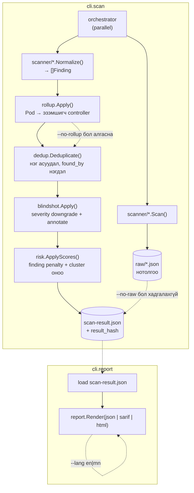

# TATAR-Kuber

> Kubernetes Security Posture Assessment Framework  
> Engineering Document #6  
> Repository Structure  
> Go project layout, модуль, build, стандарт  
> Version 1.3  ·  кодтой тулгасан (2026-09-29)  
> Enkhbat.O — Security Analyst  
> 2026-07-24

<!-- Generated from 06_Repository-Structure.docx by scripts/docx-to-md.py -- do not edit by hand. -->
*Generated from `06_Repository-Structure.docx`. The Word document is canonical; regenerate with `python3 scripts/docx-to-md.py docs/06_Repository-Structure.docx`.*

## 1. Зорилго

Кодын сангийн бүтэц, модуль бүрийн хариуцлага, build/dependency, coding стандартыг тодорхойлно. Схем ба mapping зөв бол үлдсэн нь инженерийн ажил — энэ баримт тэр ажлын хүрээг тогтооно. Хэл: Go (Kubernetes экосистем, client-go, single binary, cross-platform).

## 2. Хавтасны бүтэц

```bash
tatar-kuber/
  cmd/tatar-kuber/main.go    # entrypoint
  embed.go                   # canonical registry-г go:embed-ээр шигтгэнэ
  internal/
    cli/                     # scan · report · gate · diff · doctor · verify-lab · version (stdlib flag)
    orchestrator/            # Collect (зэрэгцээ scan + ScannerRun) · Process (normalize→rollup→dedup→blind-shot→risk)
    scanner/                 # ScannerAdapter interface (adapter.go) + toolexec/ (CLI дуудлага)
      trivy/  kubescape/  checkov/  popeye/
    normalizer/              # scanner-ийн түүхий гаралт → Unified Finding
    canonical/               # canonical-controls.yaml ачаалах, rule ID → TATAR-* зураглал, Resolver
    rollup/                  # Pod хэмжээний finding → эзэмшигч controller (dedup-аас ӨМНӨ)
    dedup/                   # canonical+resource+namespace-аар нэгтгэх, found_by нэгдэл
    blindshot/               # контекст дүрмээр severity downgrade (устгахгүй, тэмдэглэнэ)
    risk/                    # severity normalize, risk_factors, cluster оноо ба breakdown
    diff/                    # хоёр scan-result.json-ыг тулгах (trending, scanner coverage)
    policy/                  # .tatar-kuber.yaml: fail_on · min_score · suppress (expires-тэй)
    finding/                 # Unified Finding / ScanResult бүтэц, StableID, severity зэрэглэл
    report/json/  report/sarif/  report/html/
  pkg/schema/tatar-schema-v1.json   # Unified Finding JSON Schema (нийтийн)
  schema/canonical-controls.yaml    # canonical control registry — бүтээгдэхүүний ГОЛ ХӨРӨНГӨ
  examples/
    demo/                    # хөлдөөсөн бодит scanner гаралт (golden корпусын оролт)
    vulnerable/              # зориудаар эмзэг манифестууд (kind cluster-т deploy хийгддэг)
    report/                  # нийтлэгдсэн жишээ тайлан (GitHub Pages)
  testdata/
    golden/demo.json         # бүтэн pipeline-ийн хөлдөөсөн үр дүн (зураглалын золиос корпус)
    checkov/ kubescape/ popeye/ lab/   # adapter тус бүрийн fixture
  docs/
    0*.docx                  # энэ 6 инженерийн баримт
    coverage.md              # ҮҮСГЭСЭН: control × scanner матриц (TestCoverageDoc барина)
    releases/vX.Y.Z.md       # release notes-ийн ЭХ ХУВЬ (release-notes.yml тулгана)
    img/  MITRE_ATTACK.md  dedup-example.md
  deploy/least-privilege-clusterrole.yaml
  scripts/build.sh  scripts/validate_registry.py
  .github/workflows/         # ci · real-cluster · static-scan · release · release-notes · pages · security-gate
  action.yml  install.sh  Dockerfile  Dockerfile.goreleaser
  .goreleaser.yaml  .gitattributes  .tatar-kuber.yaml.example
  go.mod                     # ганц хамаарал: gopkg.in/yaml.v3
```

## 3. Модулийн хариуцлага

| **Модуль** | **Хариуцлага** |
|---|---|
| cli | stdlib flag дээрх командууд (cobra БИШ): scan · report · gate · diff · doctor · verify-lab · version. Флаг seman­tик, exit code. |
| orchestrator | Collect: adapter бүрийг зэрэг ажиллуулж ScannerRun бүртгэнэ. Process: normalize → rollup → dedup → blind-shot → risk → ScanResult. |
| scanner/\* | Scanner тус бүрийн ScannerAdapter хэрэгжүүлэлт; toolexec нь CLI дуудлага, timeout, graceful degradation. |
| normalizer | Scanner-ийн түүхий гаралтыг Unified Finding болгож, canonical зураглалыг тавина. |
| canonical | canonical-controls.yaml ачаалах, rule ID → TATAR-\* зураглал, Resolver, зураглалгүй rule-ийн бүртгэл. |
| rollup | Pod хэмжээний finding-ийг эзэмшигч controller руу зөөнө (dedup-аас ӨМНӨ). --no-rollup-аар болино. |
| dedup | canonical+resource+namespace-аар нэгтгэх, found_by нэгдэл, батлагдлаас confidence. |
| blindshot | Контекст дүрмээр severity downgrade — устгахгүй, original_severity хадгална. |
| risk | Severity normalize, finding тус бүрийн risk_factors, cluster оноо ба risk_breakdown. |
| diff | Хоёр ScanResult-ыг тогтвортой ID-гаар тулгах: шинэ/зассан/дордсон/сайжирсан + scanner coverage зөрүү. |
| policy | .tatar-kuber.yaml ачаалах ба үнэлэх: fail_on, min_score, хугацаатай suppress, хуучирсан дүрмийн бүртгэл. |
| finding | Unified Finding ба ScanResult бүтэц, StableID, severity зэрэглэл — бусад бүх пакетын нийтлэг хэл. |
| report | json / sarif / html гаргах. SARIF нь тогтвортой partialFingerprints-тэй; HTML нь --lang дагаж хоёр хэлээр. |

## 4. Өгөгдлийн урсгал (data flow)



## 5. Build ба гаралт

Single static binary, cross-platform. Хамаарал ганц (yaml.v3) тул build хурдан. Makefile БАЙХГҮЙ — командууд шууд.

```bash
./scripts/build.sh 1.0.3   # windows/linux/macos binary (ldflags-аар хувилбар)
go test ./...              # 17 пакет (golden корпус ба coverage матриц орно)
gofmt -l . && go vet ./... # CI-д мөн govulncheck + gosec
git tag vX.Y.Z && git push origin vX.Y.Z   # goreleaser автоматаар (Makefile БАЙХГҮЙ)

Гаралт:
  tatar-kuber.exe          (windows/amd64)
  tatar-kuber-linux        (linux/amd64, arm64)
  tatar-kuber-macos        (darwin/amd64, arm64)
```

## 6. Хамаарал (dependencies)

| **Багц** | **Зорилго** |
|---|---|
| gopkg.in/yaml.v3 | ГАНЦ гуравдагч талын хамаарал: canonical-controls.yaml ба .tatar-kuber.yaml задлах. |
| stdlib: flag | CLI бүтэц. cobra/viper ХЭРЭГЛЭДЭГГҮЙ — хамаарлыг хамгийн бага байлгах зорилготой. |
| stdlib: html/template | HTML dashboard. go.mod-д toolchain пиннэсэн нь escaper-ийн CVE зассан stdlib-ийг баталгаажуулна. |
| stdlib: encoding/json | Unified Finding, SARIF 2.1.0, scanner-ийн түүхий гаралт. |
| (хамааралгүй) | k8s.io/client-go ХЭРЭГГҮЙ: cluster руу scanner CLI-ууд өөрсдөө холбогдоно. |
| (хамааралгүй) | cosign / gojsonschema ХЭРЭГЛЭДЭГГҮЙ. Scanner баталгаажуулалт нь update командтай хамт v2-т. |

**Тэмдэглэл: Scanner-ууд embed хийгдэхгүй — тусад нь суулгагдана. Энэ нь лицензийг цэвэр байлгана (Trivy/Kubescape/Checkov Apache-2.0). ХАРИН canonical registry (schema/canonical-controls.yaml) нь go:embed-ээр binary дотор шигтгэгдсэн тул суулгасан binary дангаараа ажиллана (--registry зөвхөн дарж бичихэд)., binary хэмжээг багасгана.**

## 7. Scanner хувилбарын түгжрэл (supply-chain)

ТӨЛӨВЛӨГӨӨ (v2 — \`update\` команд хараахан хэрэгжээгүй). Аудитын давтагдах чадвар болон supply-chain аюулгүй байдлын үүднээс scanner хувилбарыг lockfile-оор түгжих санаа. v1-д scanner-уудыг хэрэглэгч өөрөө суулгаж, \`doctor\` нь суусан хувилбарыг тайлагнана.

```bash
# tools.lock.yaml
tools:
  trivy:
    version: "0.53.0"
    sha256:  "9af2c1..."
    cosign:  "verified"
  kubescape:
    version: "3.0.8"
    sha256:  "b71e44..."
    cosign:  "verified"
```

## 8. Coding стандарт ба тест

- gofmt + golangci-lint заавал. CI-д lint/test pass болоогүй бол merge хийхгүй.
- Adapter бүр normalize unit test-тэй: testdata/\<scanner\>/\*.json → хүлээгдсэн \[\]Finding.
- dedup, risk, blindshot, rollup, diff модулиуд table-driven unit test-тэй (тодорхой оролт → тодорхой оноо).
- result_hash тогтмол, давтагдахуйц байхыг баталгаажуулах тест (ижил оролт → ижил hash).
- Secret/temp файл аюулгүй зохицуулалт (0600 permission, ажиллагаа дуусахад цэвэрлэх).
- Хувилбарлалт: semver. canonical-controls.yaml болон finding schema тус бүрийн хувилбартай.

## Хувилбарын тэмдэглэл — v1.1 / v1.2 / v1.3

- updater/ пакет байхгүй (update команд v2-т). Түүний оронд orchestrator/ бүртгэгдэв: Collect (зэрэгцээ scan + ScannerRun) ба Process (normalize/dedup/blind-shot/score).
- internal/kube/ УСТСАН. v1-д k8s.io/client-go хамаарал хэрэггүй — scanner CLI-ууд cluster-т өөрсдөө холбогдоно. Go хамаарал ГАНЦ: gopkg.in/yaml.v3.
- cli/ нь cobra биш stdlib flag дээр (scan, report, gate, doctor, verify-lab, version).
- Тест: 15 пакет (internal/cli-д E2E тест нэмэгдсэн: scan -\> report -\> gate, флагийн семантик). internal/canonical-д дөрвөн scanner бүрийн зураглалын утгыг upstream-тай тулгах meaning-lock тестүүд.
- CI workflow: ci.yml (build/vet/test + govulncheck/gosec), real-cluster.yml (бодит kind cluster, scanner тус бүрийн шалгалт), static-scan.yml (Mode A — бодит Checkov, cluster шаардахгүй), release.yml, pages.yml, security-gate.yml.
- canonical registry go:embed-ээр шигтгэгдсэн (embed.go) тул binary дангаараа ажиллана.
- internal/rollup/ ШИНЭ пакет: Pod хэмжээнд тайлагдсан finding-ийг эзэмшигч controller (Deployment/StatefulSet/DaemonSet/Job/CronJob/ReplicaSet) руу зөөнө. dedup-аас ӨМНӨ ажиллана; зөвхөн тухайн canonical control дээр controller хэмжээний finding аль хэдийн байгаа, ижил namespace, мөн pod-ийн нэр Kubernetes-ийн үүсгэсэн дагавартай (rand.SafeEncodeString-ийн эгшиггүй алфавит) яг таарсан үед. --no-rollup флагаар болино; зөөлт metadata.rollup-д бүртгэгдэж, pod нэр evidence-д хадгалагдана.
- Тест: 16 пакет (internal/rollup нэмэгдэв — 6 тест: эзэмшил, урт нэрийн давуу байдал, "api-canary" төрлийн хуурамч таарал, нотолгоо хадгалалт, dedup-той хамт).
- Хавтасны бүтэц: parser/, normalizer/, scoring/, audit/, config/, tests/ гэсэн нэрс #2-т төлөвлөсөн хэлбэр байсан. Бодит код: internal/{cli,orchestrator,rollup,scanner/\*,canonical,dedup,blindshot,risk,mitre,policy,report/{json,sarif,html},finding,version}; тест нь пакет тус бүрийн \*_test.go дотор, testdata/ дор fixture.
- (v1.3) §2 ХАВТАСНЫ БҮТЭЦ, модулийн ба хамаарлын хүснэгтийг БОДИТ кодтой бүрэн тулгав. Өмнө нь §2 нь хэрэгжүүлэхээс өмнөх ЗУРАГЛАЛ байсан бөгөөд засварыг зөвхөн төгсгөлийн тэмдэглэлд бичсэн тул §2-ыг уншсан хүн байхгүй модулийг хайх байв.
- (v1.3) Байхгүй атлаа жагсаагдсан: parser/, scoring/, audit/, config/, report/templates/, schema/finding.schema.json, tests/e2e/, Makefile (make build/test/lint/release). Makefile огт байхгүй тул тэдгээр команд ажиллахгүй.
- (v1.3) Байгаа атлаа жагсаагдаагүй: internal/{diff,policy,rollup,finding,risk}, pkg/schema/, examples/, testdata/, deploy/, scripts/, embed.go, install.sh, action.yml, .github/. Мөн өмнөх тэмдэглэлд internal/mitre ба internal/version гэж бичсэн нь ч БАЙХГҮЙ — засварын засвар мөн буруу байв.
- (v1.3) Хамаарлын хүснэгтэд cobra, viper, cosign, gojsonschema жагсаагдсан байсан. go.mod-д ГАНЦ хамаарал: gopkg.in/yaml.v3. Үлдсэн нь stdlib.
- (v1.3) §7 tools.lock.yaml нь ТӨЛӨВЛӨГӨӨ гэдгийг тодруулав (update команд v2-т).
- (v1.3) internal/diff/ ШИНЭ: хоёр ScanResult-ыг тогтвортой ID-гаар тулгаж trending гаргана; scanner coverage-ийн бууралтыг "зассан" гэж уншихаас сэргийлнэ.
- (v1.3) testdata/golden/demo.json ШИНЭ: бүтэн pipeline-ийн хөлдөөсөн үр дүн. Зураглал ЧИМЭЭГҮЙ эвдрэхийг PR дээр барина (нийт тоо хөдлөхгүй байхад scanner тус бүрийн хувь нэмэр хөдөлдөг тохиолдол).
- (v1.3) docs/coverage.md ба docs/releases/ ШИНЭ. Хоёулаа тестээр/workflow-оор эх сурвалжтайгаа тулгагддаг: TestCoverageDoc ба release-notes.yml.
- (v1.3) Тест: 17 пакет (internal/diff нэмэгдэв). Workflow 7: ci · real-cluster · static-scan · release · release-notes · pages · security-gate.
